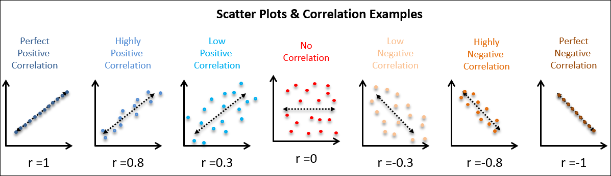
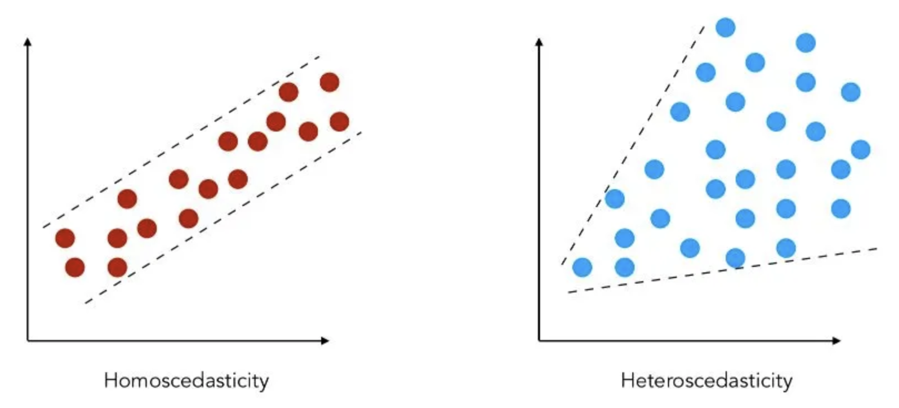

```{r}
#| echo: false
#| cache: false
require(tidyverse)
require(ggthemes)
require(gt)
require(gganimate)
require(ggforce)

knitr::opts_chunk$set(comment = ">")

# set transparent background in base
knitr::opts_chunk$set(dev.args=list(bg='transparent'))

# set transparent background in ggplot
ggplot2::theme_set(ggthemes::theme_tufte(base_size=12))
ggplot2::theme_update(panel.background = ggplot2::element_blank(),
                      plot.background=ggplot2::element_blank(),
    legend.background=ggplot2::element_blank())

options(width=80, show.signif.stars=FALSE)
```

# Scatterplots and correlation {.section-title background-color="#c5b4e3"}

## Overview of Correlation 

:::: {.columns}

::: {.column width="50%"}

::: {.fragment fragment-index=1 style="text-align: center; border: 4px solid #a68100; border-radius: 15px; padding: 5px 5px 5px 5px;"}
#### [Looking at the [association]{.underline} between variables]{style="font-size: 1.25em"}

* The statistical link between variables
* Tendency for certain types of *values* of one variable to coincide with certain kinds of *values* of the other variable
:::

::: {.fragment fragment-index=1 style="text-align: center; border: 4px solid #a68100; border-radius: 15px; padding: 5px 5px 5px 5px;"}
FIRST step in assessing arguments that one variable (independent variable) has a causal impact on another (dependent variable)
:::

:::: {.columns}

::: {.column width="45%"}
::: {.fragment fragment-index=3 style="font-size: 0.85em; text-align: center; border: 4px solid #754cbc; border-radius: 15px; padding: 5px 5px 5px 5px;"}
We've looked for associations between *nominal* and *ordinal* variables in [bivariate tables]{.underline}
:::
:::
  
::: {.column width="52%"}

::: {.fragment fragment-index=4 style="background: #c5b4e3; font-size: 1.05em; text-align: center; border: 4px solid #754cbc; border-radius: 15px; padding: 5px 5px 5px 5px;"}
Now we want to measure association for **interval** variables
:::
:::
  
::::

:::
  
::: {.column width="50%"}
::: {.fragment fragment-index=2 style="font-size: 1.4em; background: #2ad2c9; border: 4px solid #1b8883; border-radius: 15px; padding: 5px 5px 5px 5px; text-align: center;"}
[**STRENGTH**]{.underline style="color: #115450"} <br>
How strong is the tendency for certain values of Y to go with particular values of X?
:::


::: {.fragment fragment-index=2 style="font-size: 1.4em; background: #e93cac; border: 4px solid #690c48; border-radius: 15px; padding: 5px 5px 5px 5px; text-align: center"}
[**DIRECTION**]{.underline style="color: #690c48"} <br>
Is the association positive or negative?
:::


::: {.fragment fragment-index=2 style="font-size: 1.4em; background: #aadb1e; border: 4px solid #6e8e13; border-radius: 15px; padding: 5px 5px 5px 5px; text-align: center"}
[**STATISTICAL SIGNIFICANCE**]{.underline style="color: #44580c"} <br>
How certain can we be that the association exists in the population?
:::
:::
  
::::

## Correlation and Scatterplots

::: {style="font-size: 1.25em"}
> [Scatterplot]{style="color: #e93cac"}: A graph that uses points to simultaneously display the value on two variables for each case in the data
:::

::: {.fragment fragment-index=1 .center}
Allows us to picture the association between variables
:::

[**Example: Association between hiker weight and weight of backpack carried**]{.fragment fragment-index=2 style="font-size: 1.15em"}

:::: {.columns}

::: {.column width="35%"}
::: {.fragment fragment-index=2}
```{r}
#| echo: false

weights <- tibble(body = c(120, 187, 109, 103, 131, 165, 158, 116), backpack = c(26, 30, 26, 24, 29, 35, 31, 28))

weights |> 
  gt() |> 
  cols_align(align = "center", columns = everything()) |> # center columns
  opt_table_outline(color = "#85754d") |> # outline table with colored border 
  tab_options(table.background.color = "#e8e3d3", table_body.hlines.color = "#85754d", table_body.vlines.color = "#85754d", table_body.border.top.color = "#85754d", 
              table_body.border.bottom.color = "#85754d", stub.border.color = "#85754d", heading.border.bottom.color = "#85754d",  column_labels.border.bottom.color = "#85754d") 
```
:::
:::
  
::: {.column width="65%"}
::: {.fragment fragment-index=3}
```{r}
#| echo: false
#| fig-width: 8
#| fig-height: 4.5

ggplot(weights, aes(x = body, y = backpack)) + 
  geom_point(size = 4, color = "#e93cac") + 
  labs(x = "Body weight (lb)", y = "Pack weight (lb)") + 
  scale_y_continuous(breaks = seq(from = 20, to = 37, by = 2), labels = c("20", "22", "24", "26", "28", "30", "32", "34", "36")) +
  scale_x_continuous(breaks = seq(from = 100, to = 195, by = 10)) +
  annotate(geom = "segment", x = 120, y = 20, yend = 26, linetype = 2, color = "#e93cac", linewidth = 2, alpha = 0.5) +
  annotate(geom = "segment", x = 100, y = 26, xend = 120, linetype = 2, color = "#e93cac", linewidth = 2, alpha = 0.5) +
  coord_cartesian(clip = 'off') +
  theme_tufte(base_size = 22) + 
  theme(plot.margin = margin(2, 3, 0.25, 0.25, "cm"))
```

:::
:::
  
::::


## Correlation and Scatterplots

::: {style="font-size: 1.25em"}
> [Scatterplot]{style="color: #e93cac"}: A graph that uses points to simultaneously display the value on two variables for each case in the data
:::

::: {.center}
Allows us to picture the association between variables
:::

[**Example: Association between hiker weight and weight of backpack carried**]{style="font-size: 1.15em"}

:::: {.columns}

::: {.column width="35%"}

```{r}
#| echo: false

weights <- tibble(body = c(120, 187, 109, 103, 131, 165, 158, 116), backpack = c(26, 30, 26, 24, 29, 35, 31, 28))

weights |> 
  gt() |> 
  cols_align(align = "center", columns = everything()) |> # center columns
  opt_table_outline(color = "#85754d") |> # outline table with colored border 
  tab_options(table.background.color = "#e8e3d3", table_body.hlines.color = "#85754d", table_body.vlines.color = "#85754d", table_body.border.top.color = "#85754d", 
              table_body.border.bottom.color = "#85754d", stub.border.color = "#85754d", heading.border.bottom.color = "#85754d",  column_labels.border.bottom.color = "#85754d") 
```

:::
  
::: {.column width="65%"}

```{r}
#| echo: false
#| fig-width: 8
#| fig-height: 4.5

ggplot(weights, aes(x = body, y = backpack)) + 
  geom_point(size = 4, color = "#e93cac") + 
  labs(x = "Body weight (lb)", y = "Pack weight (lb)") + 
  scale_y_continuous(breaks = seq(from = 20, to = 37, by = 2), labels = c("20", "22", "24", "26", "28", "30", "32", "34", "36")) +
  scale_x_continuous(breaks = seq(from = 100, to = 195, by = 10)) +
  annotate(geom = "segment", x = 120, y = 20, yend = 26, linetype = 2, color = "#e93cac", linewidth = 2, alpha = 0.5) +
  annotate(geom = "segment", x = 100, y = 26, xend = 120, linetype = 2, color = "#e93cac", linewidth = 2, alpha = 0.5) +
  coord_cartesian(clip = 'off') +
  theme_tufte(base_size = 22) + 
  theme(plot.margin = margin(2, 3, 0.25, 0.25, "cm"))
```


:::
  
::::

::: {.fragment .fade-out fragment-index=1 style="border: 3px solid #1b8883; border-radius: 15px; width: 485px; height: 25px; padding: 5px 5px 5px 5px; position: absolute; bottom: 25px; left: 440px"}

:::

::: {.fragment .fade-out fragment-index=1 style="background: #2ad2c9; border: 4px solid #1b8883; border-radius: 15px; width: 250px; padding: 5px 5px 5px 5px; position: absolute; bottom: 85px; right: -50px; text-align: center; font-size: 0.75em"}
X-axis (horizontal) displays all values in the IV
:::

::: {.fragment .fade-out fragment-index=2}
::: {.fragment fragment-index=1 style="border: 3px solid #1b8883; border-radius: 15px; width: 25px; height: 235px; padding: 5px 5px 5px 5px; position: absolute; bottom: 40px; left: 410px"}

:::
:::

::: {.fragment .fade-out fragment-index=2}
::: {.fragment fragment-index=1 style="background: #2ad2c9; border: 4px solid #1b8883; border-radius: 15px; width: 250px; padding: 5px 5px 5px 5px; position: absolute; bottom: 250px; right: 300px; text-align: center; font-size: 0.75em"}
Y-axis (vertical) displays all values on the DV
:::
:::

::: {.fragment fragment-index=2 style="border: 3px solid #1b8883; border-radius: 15px; width: 25px; height: 25px; padding: 5px 5px 5px 5px; position: absolute; bottom: 173px; right: 407px"}

:::

::: {.fragment fragment-index=2 style="background: #2ad2c9; border: 4px solid #1b8883; border-radius: 15px; width: 300px; padding: 5px 5px 5px 5px; position: absolute; bottom: 75px; right: 100px; text-align: center; font-size: 0.75em"}
Each dot represents a case, positioned along the X and Y axes
:::


## Correlation and Scatterplots

::: {style="font-size: 1.25em"}
> [Scatterplot]{style="color: #e93cac"}: A graph that uses points to simultaneously display the value on two variables for each case in the data
:::

::: {.center}
Allows us to picture the association between variables
:::

[**Example: Association between hiker weight and weight of backpack carried**]{style="font-size: 1.15em"}

:::: {.columns}

::: {.column width="35%"}

```{r}
#| echo: false

weights <- tibble(body = c(120, 187, 109, 103, 131, 165, 158, 116), backpack = c(26, 30, 26, 24, 29, 35, 31, 28))

weights |> 
  gt() |> 
  cols_align(align = "center", columns = everything()) |> # center columns
  opt_table_outline(color = "#85754d") |> # outline table with colored border 
  tab_options(table.background.color = "#e8e3d3", table_body.hlines.color = "#85754d", table_body.vlines.color = "#85754d", table_body.border.top.color = "#85754d", 
              table_body.border.bottom.color = "#85754d", stub.border.color = "#85754d", heading.border.bottom.color = "#85754d",  column_labels.border.bottom.color = "#85754d") 
```

:::
  
::: {.column width="65%"}

```{r}
#| echo: false
#| fig-width: 8
#| fig-height: 4.5

ggplot(weights, aes(x = body, y = backpack)) + 
  geom_point(size = 4, color = "#e93cac") + 
  labs(x = "Body weight (lb)", y = "Pack weight (lb)") + 
  scale_y_continuous(breaks = seq(from = 20, to = 37, by = 2), labels = c("20", "22", "24", "26", "28", "30", "32", "34", "36")) +
  scale_x_continuous(breaks = seq(from = 100, to = 195, by = 10)) +
  annotate(geom = "segment", x = 120, y = 20, yend = 26, linetype = 2, color = "#e93cac", linewidth = 2, alpha = 0.5) +
  annotate(geom = "segment", x = 100, y = 26, xend = 120, linetype = 2, color = "#e93cac", linewidth = 2, alpha = 0.5) +
  geom_mark_ellipse(color = "#e93cac", alpha = 0.5, expand = unit(4, "mm")) +
  coord_cartesian(clip = 'off') +
  theme_tufte(base_size = 22) + 
  theme(plot.margin = margin(2, 3, 0.25, 0.25, "cm"))
```


:::
  
::::

::: {style="background: #e93cac; border: 4px solid #690c48; border-radius: 15px; width: 350px; padding: 5px 5px 5px 5px; position: absolute; bottom: 0px; right: -75px; text-align: center; font-size: 0.75em"}
**Can see the (positive) association**<br>
*(high values on one variable tend to go with high values on the other)*
:::

## Correlation and Regression

<br>

::: {style="font-size: 1.5em; text-align: center"}
The two most common tool for measuring <br> associations between [interval]{.underline} variables
:::

:::: {.columns}

::: {.column width="50%"}

::: {.fragment fragment-index=1 style="background: #ffc700; border: 4px solid #a68100; border-radius: 15px; padding: 5px 5px 5px 5px; text-align: center; font-size: 1.5em"}
**CORRELATION**
:::

::: {.fragment fragment-index=3 style="background: #ffc700; border: 4px solid #a68100; border-radius: 15px; padding: 5px 5px 5px 5px; text-align: center; font-size: 1em"}
[[**standardized**]{.underline} summary of association between our variables]{style="font-size: 1.25em"}

* does not depend on the units of the variables
    * always 0 to |1.0|
* allows for comparison of associations between different pairs of variables
:::

:::

::: {.column width="50%"}

::: {.fragment fragment-index=1 style="background: #c5b4e3; border: 4px solid #754cbc; border-radius: 15px; padding: 5px 5px 5px 5px; text-align: center; font-size: 1.5em"}
**REGRESSION**
:::

::: {.fragment fragment-index=4 style="background: #c5b4e3; border: 4px solid #754cbc; border-radius: 15px; padding: 5px 5px 5px 5px; text-align: center;"}
[characterizes the [**substantive**]{.underline} effect of X on Y]{style="font-size: 1.25em"}

* how much Y differs across different values of X
* conveyed in units of our specific independent and dependent variables
:::

:::

::::

::: {.fragment .fade-out fragment-index=3}
::: {.fragment fragment-index=2 style="position: absolute; bottom: 0px; left: 0px; width: 500px"}
```{r}
#| echo: false
#| fig-width: 8
#| fig-height: 4.5

set.seed(3)
earnings_age <- tibble(Age = sample(18:70, size = 50, replace = TRUE), 
                       Earnings = Age * 3 + rnorm(n = 50, mean = 60, sd = 50))

ggplot(earnings_age, aes(x = Age, y = Earnings)) + 
  geom_point(size = 4, color = "#e93cac") +
  theme_tufte(base_size = 22) 
```
:::
:::

::: {.fragment .fade-out fragment-index=3}
::: {.fragment fragment-index=2 style="border: 3px solid #e93cac; margin: 5px; position: absolute; bottom: 100px; right: 0px; width: 500px; text-align: center"}
Both correlation and regression are based on a description of a line used to characterize data points in a scatterplot
:::
:::

---

:::: {.columns}

::: {.column width="50%"}

<br>

::: {style="font-size: 1.75em"}
> [**Correlation Coefficient (r)**]{style="color: #e93cac"} <br>
A measure of association reflecting both the strength and the direction of the association between two interval-level variables
:::
:::
  
::: {.column width="50%"}

<br>

::: fragment

::: incremental
[Why it's helpful]{.underline}

* [**Simple**]{style="color: #e93cac"}:
    * one number to convey a lot about an association
* [**Symmetrical**]{style="color: #e93cac"}:
    * correlation of X and Y same as the correlation of Y and X
* [**Standardized**]{style="color: #e93cac"}:
    * does not depend on the units of the variables
    * always ranges from 0 to |1|
    * therefore, allows for comparison of bivariate associations between different pairs of variables
:::

:::

:::

::::

---

:::: {.columns}

::: {.column width="50%"}

<br>

::: {style="font-size: 1.75em"}
> [**Correlation Coefficient (r)**]{style="color: #e93cac"} <br>
A measure of association reflecting both the strength and the direction of the association between two interval-level variables
:::

:::
  
::: {.column width="50%"}

<br>

::: incremental
[Why you need to be careful]{.underline}

* [Correlation (and regression) only work well with linear associations]{style="color: #e93cac"}
    * i.e., scatterplot shows a roughly straight-line pattern
* [Correlation ≠ causation]{style="color: #e93cac"}
    * The observed association might be due to some third “lurking” variable
    * i.e., the association might be spurious
* [Don’t extrapolate]{style="color: #e93cac"}
    * Can’t use the observed association to draw conclusions about the association among individuals with values outside of your observed range on the variables

:::
:::

::::

---

:::: {.columns}

::: {.column width="50%"}

<br>

::: {style="font-size: 1.75em"}
> [**Correlation Coefficient (r)**]{style="color: #e93cac"} <br>
A measure of association reflecting both the strength and the direction of the association between two interval-level variables
:::
:::
  
::: {.column width="50%"}

::: incremental
[Interpretation]{.underline}

* [Sign indicates the direction of the association]{style="color: #e93cac"}
    * [Positive correlation indicates a positive association]{style="color: #1b8883"}
        * high values on one variable tend to correspond with high values on the other variable
        * e.g., education and income have a positive correlation
    * [Negative correlation indicates a negative association]{style="color: #1b8883"}
        * high values on one variable tend to correspond with low values on the other variable
        * e.g., income and stress have a negative correlation

:::
:::

::::

---

:::: {.columns}

::: {.column width="50%"}

<br>

::: {style="font-size: 1.75em"}
> [**Correlation Coefficient (r)**]{style="color: #e93cac"} <br>
A measure of association reflecting both the strength and the direction of the association between two interval-level variables
:::
:::
  
::: {.column width="50%"}

::: incremental
[Interpretation]{.underline}

* [Value of the number indicates strength of association]{style="color: #e93cac"}
    * [*i.e., how strong is the tendency for certain values on one variable to correspond with certain values on the other?*]{style="color: #1b8883"}
    * Minimum value = 0
        * Values close to 0 indicate no association
    * Maximum value = 1 or -1
        * values close to -1.0 or 1.0 indicate strong relationships
    * Rule of thumb (in absolute values):
        * 0.00 to 0.30 = weak association
        * 0.31 to 0.60 = moderate association
        * 0.61 to 1.0 = strong association
:::
:::

::::

## Practice {visibility="hidden"}

<br>

*What type of correlations are the following?*

::: incremental
* Correlation (r) for education and income = 0.385 <br> [moderate and positive]{style="color: #e8e3d3"}
* Correlation (r) for education and stress = -0.615 <br> [strong and negative]{style="color: #e8e3d3"}
* Correlation (r) for hours studied and number of dates = 0.045 <br> [weak and positive]{style="color: #e8e3d3"}
* Correlation (r) for number of children and number of hours of sleep = -0.421 <br> [moderate and negative]{style="color: #e8e3d3"}
:::

## Practice 

<br>

*What type of correlations are the following?*

::: incremental
* Correlation (r) for education and income = 0.385 <br> [moderate and positive]{.fragment style="color: #e93cac"}
* Correlation (r) for education and stress = -0.615 <br> [strong and negative]{.fragment style="color: #e93cac"}
* Correlation (r) for hours studied and number of dates = 0.045 <br> [weak and positive]{.fragment style="color: #e93cac"}
* Correlation (r) for number of children and number of hours of sleep = -0.421 <br> [moderate and negative]{.fragment style="color: #e93cac"}
:::

---

#### [Scatterplots allow us to picture the association between variables]{style="font-size: 1.25em"}

<br> 
<br>

::: {style="position: absolute; left: -75px; width: 300%"}

:::

::: {.fragment fragment-index=1 style="position: absolute; top: 60px; left: 250px; text-align: center;"}
**Stronger associations = more tightly clustered points**
:::

::: {.fragment .fade-out fragment-index=3}
::: {.fragment fragment-index=2 style="position: absolute; bottom: 50px; text-align: center; color: #6e8e13;"}
Weak associations have lots of conditional variation and not much difference in conditional distributions (distribution of the DV across values of the IV)
:::
:::

::: {.fragment .fade-out fragment-index=3}
::: {.fragment fragment-index=2 style="border: 3px solid #6e8e13; width: 200px; height: 275px; position: absolute; bottom: 200px; left: 250px;"}

:::
:::

::: {.fragment .fade-out fragment-index=3}
::: {.fragment fragment-index=2 style="border: 3px solid #6e8e13; width: 200px; height: 275px; position: absolute; bottom: 200px; right: 250px;"}

:::
:::

::: {.fragment fragment-index=3 style="position: absolute; bottom: 50px; text-align: center; color: #754cbc"}
Strong associations have very little conditional variation and lots of difference in conditional distributions (distribution of the DV across values of the IV)
:::


::: {.fragment fragment-index=3 style="border: 3px solid #754cbc; width: 200px; height: 275px; position: absolute; bottom: 200px; left: 75px;"}

:::

::: {.fragment fragment-index=3 style="border: 3px solid #754cbc; width: 200px; height: 275px; position: absolute; bottom: 200px; right: 75px;"}

:::

## Making a scatterplot

#### Example: Do people who study more have more or fewer dates? 

::: {style="position: absolute; left: -50px"}
```{r}
#| echo: false

dates <- tibble(hours = c(10, 15, 10, 6, 2, 7, 10, 12, 7, 20), dates = c(1, 2, 5, 1, 0, 3, 4, 3, 1, 3))

dates |>
  gt() |> 
  cols_align(align = "center", columns = everything()) |> # center columns
  opt_table_outline(color = "#85754d") |> # outline table with colored border 
  tab_options(table.background.color = "#e8e3d3", table_body.hlines.color = "#85754d", table_body.vlines.color = "#85754d", table_body.border.top.color = "#85754d", 
              table_body.border.bottom.color = "#85754d", stub.border.color = "#85754d", heading.border.bottom.color = "#85754d",  column_labels.border.bottom.color = "#85754d") |> 
  cols_label(hours = "Hours studied", dates = "Dates")
```
:::

::: {.fragment style="position: absolute; left: 200px; top: 200px"}
```{r}
#| echo: false
#| fig-width: 8
#| fig-height: 4.5

ggplot(dates, aes(x = hours, y = dates)) + 
  geom_point(size = 4, color = "black") + 
  labs(x = "Hours studied", y = "Dates") + 
  theme_tufte(base_size = 22) 
```
:::

## Making a scatterplot

#### Example: Do people who study more have more or fewer dates? 

::: {style="position: absolute; left: -50px"}
```{r}
#| echo: false

dates <- tibble(hours = c(10, 15, 10, 6, 2, 7, 10, 12, 7, 20), dates = c(1, 2, 5, 1, 0, 3, 4, 3, 1, 3))

dates |>
  gt() |> 
  cols_align(align = "center", columns = everything()) |> # center columns
  opt_table_outline(color = "#85754d") |> # outline table with colored border 
  tab_options(table.background.color = "#e8e3d3", table_body.hlines.color = "#85754d", table_body.vlines.color = "#85754d", table_body.border.top.color = "#85754d", 
              table_body.border.bottom.color = "#85754d", stub.border.color = "#85754d", heading.border.bottom.color = "#85754d",  column_labels.border.bottom.color = "#85754d") |> 
  cols_label(hours = "Hours studied", dates = "Dates") |> 
  tab_style( style = cell_fill(color = "#a68100"), locations = cells_column_labels(columns = hours))
```
:::

::: {style="position: absolute; left: 200px; top: 200px"}
```{r}
#| echo: false
#| fig-width: 8
#| fig-height: 4.5

ggplot(dates, aes(x = hours, y = dates)) + 
  geom_point(size = 4, color = "black") + 
  labs(x = "Hours studied", y = "Dates") + 
  theme_tufte(base_size = 22) + 
  theme(axis.title.x = element_text(colour = "#a68100"))
```
:::

## Making a scatterplot

#### Example: Do people who study more have more or fewer dates? 

::: {style="position: absolute; left: -50px"}
```{r}
#| echo: false

dates <- tibble(hours = c(10, 15, 10, 6, 2, 7, 10, 12, 7, 20), dates = c(1, 2, 5, 1, 0, 3, 4, 3, 1, 3))

dates |>
  gt() |> 
  cols_align(align = "center", columns = everything()) |> # center columns
  opt_table_outline(color = "#85754d") |> # outline table with colored border 
  tab_options(table.background.color = "#e8e3d3", table_body.hlines.color = "#85754d", table_body.vlines.color = "#85754d", table_body.border.top.color = "#85754d", 
              table_body.border.bottom.color = "#85754d", stub.border.color = "#85754d", heading.border.bottom.color = "#85754d",  column_labels.border.bottom.color = "#85754d") |> 
  cols_label(hours = "Hours studied", dates = "Dates") |> 
  tab_style(style = cell_fill(color = "#a68100"), locations = cells_column_labels(columns = hours)) |> 
  tab_style(style = cell_fill(color = "#754cbc"), locations = cells_column_labels(columns = dates))
```
:::

::: {style="position: absolute; left: 200px; top: 200px"}
```{r}
#| echo: false
#| fig-width: 8
#| fig-height: 4.5

ggplot(dates, aes(x = hours, y = dates)) + 
  geom_point(size = 4, color = "black") + 
  labs(x = "Hours studied", y = "Dates") + 
  theme_tufte(base_size = 22) + 
  theme(axis.title.x = element_text(colour = "#a68100"), 
        axis.title.y = element_text(colour = "#754cbc"))
```
:::

## Making a scatterplot

#### Example: Do people who study more have more or fewer dates? 

::: {style="position: absolute; left: -50px"}
```{r}
#| echo: false

dates <- tibble(hours = c(10, 15, 10, 6, 2, 7, 10, 12, 7, 20), dates = c(1, 2, 5, 1, 0, 3, 4, 3, 1, 3))

dates |>
  gt() |> 
  cols_align(align = "center", columns = everything()) |> # center columns
  opt_table_outline(color = "#85754d") |> # outline table with colored border 
  tab_options(table.background.color = "#e8e3d3", table_body.hlines.color = "#85754d", table_body.vlines.color = "#85754d", table_body.border.top.color = "#85754d", 
              table_body.border.bottom.color = "#85754d", stub.border.color = "#85754d", heading.border.bottom.color = "#85754d",  column_labels.border.bottom.color = "#85754d") |> 
  cols_label(hours = "Hours studied", dates = "Dates") |> 
  tab_style(style = cell_fill(color = "#a68100"), locations = cells_column_labels(columns = hours)) |> 
  tab_style(style = cell_fill(color = "#754cbc"), locations = cells_column_labels(columns = dates)) |> 
  tab_style(style = cell_fill(color = "#e93cac"), locations = cells_body(columns = c(hours, dates), rows = dates == 4))
```
:::

::: {style="position: absolute; left: 200px; top: 200px"}
```{r}
#| echo: false
#| fig-width: 8
#| fig-height: 4.5

ggplot(dates, aes(x = hours, y = dates)) + 
  geom_point(size = 4, color = "black") + 
  annotate(geom = "point", x = 10, y = 4, size = 4, color = "#e93cac") + 
  labs(x = "Hours studied", y = "Dates") + 
  theme_tufte(base_size = 22) + 
  theme(axis.title.x = element_text(colour = "#a68100"), 
        axis.title.y = element_text(colour = "#754cbc"))
```
:::

::: {.fragment style="border: 4px solid #1b8883; border-radius: 15px; padding: 5px 5px 5px 5px; position: absolute; top: 225px; right: 0px; text-align: center"}
Can see the association
:::

::: {.fragment style="background: #2ad2c9; border: 4px solid #1b8883; border-radius: 15px; padding: 5px 5px 5px 5px; position: absolute; top: 125px; right: 0px; text-align: center"}
Correlation coefficient allows us to quantify/summarize that association
:::

## Calculating correlation coefficient (r)

::: {style="font-size: 2.5em; position: absolute; top: 200px; left: 125px"}
$$
r = \frac{1}{n-1}\Sigma(\frac{x_i - \bar{x}}{s_x})(\frac{y_i - \bar{y}}{s_y})
$$
:::

::: {.fragment fragment-index=1 style="border: 3px solid #a68100; border-radius: 15px; width: 60px; height: 60px; padding: 5px 5px 5px 5px; position: absolute; top: 260px; left: 460px;"}

:::

::: {.fragment fragment-index=1 data-id="box4" style="background: #ffc700; border: 4px solid #a68100; border-radius: 15px;  padding: 5px 5px 5px 5px; position: absolute; top: 140px; left: 250px; text-align: center"}
Value of x variable<br>for an individual
:::

::: {.fragment fragment-index=2 style="border: 3px solid #a68100; border-radius: 15px; width: 60px; height: 60px; padding: 5px 5px 5px 5px; position: absolute; top: 260px; left: 575px;"}

:::

::: {.fragment fragment-index=2 data-id="box4" style="background: #ffc700; border: 4px solid #a68100; border-radius: 15px; padding: 5px 5px 5px 5px; position: absolute; top: 140px; left: 500px; text-align: center"}
Mean of<br>x variable
:::

::: {.fragment fragment-index=3 style="border: 3px solid #a68100; border-radius: 15px; width: 60px; height: 60px; padding: 5px 5px 5px 5px; position: absolute; top: 355px; left: 518px;"}

:::

::: {.fragment fragment-index=3 data-id="box4" style="background: #ffc700; border: 4px solid #a68100; border-radius: 15px; padding: 5px 5px 5px 5px; position: absolute; top: 450px; left: 525px; text-align: center"}
Standard deviation<br>of x variable
:::

::: {.fragment fragment-index=4 style="border: 3px solid #1b8883; border-radius: 15px; width: 60px; height: 60px; padding: 5px 5px 5px 5px; position: absolute; top: 260px; left: 690px;"}

:::

::: {.fragment fragment-index=4 style="background: #2ad2c9; border: 4px solid #1b8883; border-radius: 15px;  padding: 5px 5px 5px 5px; position: absolute; top: 140px; left: 650px; text-align: center"}
Value of y variable<br>for an individual
:::

::: {.fragment fragment-index=4 style="border: 3px solid #1b8883; border-radius: 15px; width: 60px; height: 60px; padding: 5px 5px 5px 5px; position: absolute; top: 260px; left: 805px;"}

:::

::: {.fragment fragment-index=4 style="background: #2ad2c9; border: 4px solid #1b8883; border-radius: 15px; padding: 5px 5px 5px 5px; position: absolute; top: 225px; right: -80px; text-align: center"}
Mean of y variable
:::

::: {.fragment fragment-index=4 style="border: 3px solid #1b8883; border-radius: 15px; width: 60px; height: 60px; padding: 5px 5px 5px 5px; position: absolute; top: 355px; left: 745px;"}

:::

::: {.fragment fragment-index=4 style="background: #2ad2c9; border: 4px solid #1b8883; border-radius: 15px; padding: 5px 5px 5px 5px; position: absolute; top: 440px; right: 0px; text-align: center"}
Standard deviation<br>of y variable
:::

::: {.fragment fragment-index=5 style="border: 3px solid #754cbc; border-radius: 15px; width: 60px; height: 60px; padding: 5px 5px 5px 5px; position: absolute; top: 292px; left: 385px;"}

:::

::: {.fragment fragment-index=5 style="background: #c5b4e3; border: 4px solid #754cbc; border-radius: 15px; padding: 5px 5px 5px 5px; position: absolute; top: 440px; left: 340px; text-align: center"}
Add up for all<br>individuals
:::

::: {.fragment fragment-index=6 style="border: 3px solid #e93cac; border-radius: 15px; width: 175px; height: 60px; padding: 5px 5px 5px 5px; position: absolute; top: 343px; left: 210px;"}

:::

::: {.fragment fragment-index=6 style="background: #e93cac; border: 4px solid #690c48; border-radius: 15px; padding: 5px 5px 5px 5px; position: absolute; top: 425px; left: 100px; text-align: center"}
Divide the whole <br> mess by n-1
:::

## Calculating correlation coefficient (r)

::: {style="font-size: 2.5em; position: absolute; top: 200px; left: 125px"}
$$
r = \frac{1}{n-1}\Sigma(\frac{x_i - \bar{x}}{s_x})(\frac{y_i - \bar{y}}{s_y})
$$
:::

::: {style="border: 3px solid #a68100; border-radius: 15px; width: 200px; height: 160px; padding: 5px 5px 5px 5px; position: absolute; top: 260px; left: 455px;"}

:::

::: {data-id="box4" style="background: #ffc700; border: 4px solid #a68100; border-radius: 15px;padding: 5px 5px 5px 5px; position: absolute; top: 75px; left: 250px; text-align: center; width: 400px"}
Just the **standardized score on x** (i.e. how many standard deviations the individual's value on x is from the mean of x)
:::

::: {style="border: 3px solid #1b8883; border-radius: 15px; width: 200px; height: 160px; padding: 5px 5px 5px 5px; position: absolute; top: 260px; left: 685px;"}

:::

::: {style="background: #2ad2c9; border: 4px solid #1b8883; border-radius: 15px; padding: 5px 5px 5px 5px; position: absolute; top: 450px; right: 0px; text-align: center; width: 400px"}
Just the **standardized score on y** (i.e. how many standard deviations the individual's value on y is from the mean of y)
:::

---

#### Calculating Correlation Coefficient (r)

::: {style="text-align: left"}
*Association between hours studied and number of dates*
:::

::: {style="background: #c5b4e3; border: 4px solid #754cbc; border-radius: 15px; padding: 2px 2px 2px 2px; position: absolute; top: -25px; right: -75px; text-align: center; font-size: 1em"}
$$
r = \frac{1}{n-1}\Sigma(\frac{x_i - \bar{x}}{s_x})(\frac{y_i - \bar{y}}{s_y})
$$
:::

::: {style="font-size: 0.9em; position: absolute; left: 0px; top: 125px; table-layout: fixed; width: 1050px"}
| Person  | Hours studied ($x_i$) | Dates ($y_i$) | [$x_i -\bar{x}$]{style="color: #e8e3d3"} | [$\frac{x_i-\bar{x}}{s_x}$]{style="color: #e8e3d3"} | [$y_i -\bar{y}$]{style="color: #e8e3d3"} | [$\frac{y_i-\bar{y}}{s_y}$]{style="color: #e8e3d3"} | [$(\frac{x_i-\bar{x}}{s_x})(\frac{y_i-\bar{y}}{s_y})$]{style="color: #e8e3d3"} |
|:------:|:------:|:------:|:------:|:------:|:------:|:------:|:------:|
| 1 | 10 | 1 | [0.10]{style="color: #e8e3d3"}  | [0.02]{style="color: #e8e3d3"} | [-1.30]{style="color: #e8e3d3"} | [-0.83]{style="color: #e8e3d3"} | [-0.02]{style="color: #e8e3d3"} |
| 2 | 15 | 2 | [5.10]{style="color: #e8e3d3"}  | [1.02]{style="color: #e8e3d3"} | [-0.30]{style="color: #e8e3d3"} | [-0.19]{style="color: #e8e3d3"} | [-0.19]{style="color: #e8e3d3"} |
| 3 | 10 | 5 | [0.10]{style="color: #e8e3d3"}  | [0.02]{style="color: #e8e3d3"} | [2.70]{style="color: #e8e3d3"} | [1.72]{style="color: #e8e3d3"} | [0.03]{style="color: #e8e3d3"} |
| 4 | 6 | 1 | [-3.90]{style="color: #e8e3d3"}  | [-0.78]{style="color: #e8e3d3"} | [-1.30]{style="color: #e8e3d3"} | [-0.83]{style="color: #e8e3d3"} | [0.64]{style="color: #e8e3d3"} |
| 5 | 2 | 0 | [-7.90]{style="color: #e8e3d3"}  | [-1.57]{style="color: #e8e3d3"} | [-2.30]{style="color: #e8e3d3"} | [-1.47]{style="color: #e8e3d3"} | [2.31]{style="color: #e8e3d3"} |
| 6 | 7 | 3 | [-2.90]{style="color: #e8e3d3"}  | [-0.58]{style="color: #e8e3d3"} | [0.70]{style="color: #e8e3d3"} | [0.45]{style="color: #e8e3d3"} | [-0.26]{style="color: #e8e3d3"} |
| 7 | 10 | 4 | [0.10]{style="color: #e8e3d3"}  | [0.02]{style="color: #e8e3d3"} | [1.70]{style="color: #e8e3d3"} | [1.08]{style="color: #e8e3d3"} | [0.02]{style="color: #e8e3d3"} |
| 8 | 12 | 3 | [2.10]{style="color: #e8e3d3"}  | [0.42]{style="color: #e8e3d3"} | [0.70]{style="color: #e8e3d3"} | [0.45]{style="color: #e8e3d3"} | [0.19]{style="color: #e8e3d3"} |
| 9 | 7 | 1 | [-2.90]{style="color: #e8e3d3"}  | [-0.58]{style="color: #e8e3d3"} | [-1.30]{style="color: #e8e3d3"} | [-0.83]{style="color: #e8e3d3"} | [0.48]{style="color: #e8e3d3"} |
| 10 | 20 | 3 | [10.10]{style="color: #e8e3d3"}  | [2.01]{style="color: #e8e3d3"} | [0.70]{style="color: #e8e3d3"} | [0.45]{style="color: #e8e3d3"} | [0.90]{style="color: #e8e3d3"} |
| **sum** | 99.00 | 23.00 |  |  |  |  | [4.11]{style="color: #e8e3d3"} |
| **mean** | 9.90 | 2.30 |
| **st. dev.** | 5.02 | 1.57 |

: {tbl-colwidths="[10,25,15,10,10,10,10,10]"}
:::

---

#### Calculating Correlation Coefficient (r)

::: {style="text-align: left"}
*Association between hours studied and number of dates*
:::

::: {style="background: #c5b4e3; border: 4px solid #754cbc; border-radius: 15px; padding: 2px 2px 2px 2px; position: absolute; top: -25px; right: -75px; text-align: center; font-size: 1em"}
$$
r = \frac{1}{n-1}\Sigma(\frac{x_i - \bar{x}}{s_x})(\frac{y_i - \bar{y}}{s_y})
$$
:::

::: {style="font-size: 0.9em; position: absolute; left: 0px; top: 125px; table-layout: fixed; width: 1050px"}
| Person  | Hours studied ($x_i$) | Dates ($y_i$) | [$x_i -\bar{x}$]{style="color: #e8e3d3"} | [$\frac{x_i-\bar{x}}{s_x}$]{style="color: #e8e3d3"} | [$y_i -\bar{y}$]{style="color: #e8e3d3"} | [$\frac{y_i-\bar{y}}{s_y}$]{style="color: #e8e3d3"} | [$(\frac{x_i-\bar{x}}{s_x})(\frac{y_i-\bar{y}}{s_y})$]{style="color: #e8e3d3"} |
|:------:|:------:|:------:|:------:|:------:|:------:|:------:|:------:|
| 1 | 10 | 1 | [0.10]{style="color: #e8e3d3"}  | [0.02]{style="color: #e8e3d3"} | [-1.30]{style="color: #e8e3d3"} | [-0.83]{style="color: #e8e3d3"} | [-0.02]{style="color: #e8e3d3"} |
| 2 | 15 | 2 | [5.10]{style="color: #e8e3d3"}  | [1.02]{style="color: #e8e3d3"} | [-0.30]{style="color: #e8e3d3"} | [-0.19]{style="color: #e8e3d3"} | [-0.19]{style="color: #e8e3d3"} |
| 3 | 10 | 5 | [0.10]{style="color: #e8e3d3"}  | [0.02]{style="color: #e8e3d3"} | [2.70]{style="color: #e8e3d3"} | [1.72]{style="color: #e8e3d3"} | [0.03]{style="color: #e8e3d3"} |
| 4 | 6 | 1 | [-3.90]{style="color: #e8e3d3"}  | [-0.78]{style="color: #e8e3d3"} | [-1.30]{style="color: #e8e3d3"} | [-0.83]{style="color: #e8e3d3"} | [0.64]{style="color: #e8e3d3"} |
| 5 | 2 | 0 | [-7.90]{style="color: #e8e3d3"}  | [-1.57]{style="color: #e8e3d3"} | [-2.30]{style="color: #e8e3d3"} | [-1.47]{style="color: #e8e3d3"} | [2.31]{style="color: #e8e3d3"} |
| 6 | 7 | 3 | [-2.90]{style="color: #e8e3d3"}  | [-0.58]{style="color: #e8e3d3"} | [0.70]{style="color: #e8e3d3"} | [0.45]{style="color: #e8e3d3"} | [-0.26]{style="color: #e8e3d3"} |
| 7 | 10 | 4 | [0.10]{style="color: #e8e3d3"}  | [0.02]{style="color: #e8e3d3"} | [1.70]{style="color: #e8e3d3"} | [1.08]{style="color: #e8e3d3"} | [0.02]{style="color: #e8e3d3"} |
| 8 | 12 | 3 | [2.10]{style="color: #e8e3d3"}  | [0.42]{style="color: #e8e3d3"} | [0.70]{style="color: #e8e3d3"} | [0.45]{style="color: #e8e3d3"} | [0.19]{style="color: #e8e3d3"} |
| 9 | 7 | 1 | [-2.90]{style="color: #e8e3d3"}  | [-0.58]{style="color: #e8e3d3"} | [-1.30]{style="color: #e8e3d3"} | [-0.83]{style="color: #e8e3d3"} | [0.48]{style="color: #e8e3d3"} |
| 10 | 20 | 3 | [10.10]{style="color: #e8e3d3"}  | [2.01]{style="color: #e8e3d3"} | [0.70]{style="color: #e8e3d3"} | [0.45]{style="color: #e8e3d3"} | [0.90]{style="color: #e8e3d3"} |
| **sum** | 99.00 | 23.00 |  |  |  |  | [4.11]{style="color: #e8e3d3"} |
| **mean** | 9.90 | 2.30 |
| **st. dev.** | 5.02 | 1.57 |

: {tbl-colwidths="[10,25,15,10,10,10,10,10]"}
:::

::: {style="border: 3px solid #e93cac; border-radius: 15px; padding: 2px 2px 2px 2px; width: 450px; height: 120px; position: absolute; bottom: 0px; left: 5px"}

:::

::: {style="color: #e93cac; background: #e8e3d3; border: 3px solid #e93cac; border-radius: 15px; padding: 5px 5px 5px 5px; position: absolute; bottom: 15px; left: 475px; text-align: center"}
Calculate means and standard<br>deviations for both variables
:::

---

#### Calculating Correlation Coefficient (r)

::: {style="text-align: left"}
*Association between hours studied and number of dates*
:::

::: {style="background: #c5b4e3; border: 4px solid #754cbc; border-radius: 15px; padding: 2px 2px 2px 2px; position: absolute; top: -25px; right: -75px; text-align: center; font-size: 1em"}
$$
r = \frac{1}{n-1}\Sigma(\frac{x_i - \bar{x}}{s_x})(\frac{y_i - \bar{y}}{s_y})
$$
:::

::: {style="font-size: 0.9em; position: absolute; left: 0px; top: 125px; table-layout: fixed; width: 1050px"}
| Person  | Hours studied ($x_i$) | Dates ($y_i$) | $x_i -\bar{x}$ | $\frac{x_i-\bar{x}}{s_x}$ | $y_i -\bar{y}$ | $\frac{y_i-\bar{y}}{s_y}$ | $(\frac{x_i-\bar{x}}{s_x})(\frac{y_i-\bar{y}}{s_y})$ |
|:------:|:------:|:------:|:------:|:------:|:------:|:------:|:------:|
| 1 | 10 | 1 | 0.10  | 0.02 | -1.30 | -0.83 | -0.02 |
| 2 | 15 | 2 | [5.10]{style="color: #e8e3d3"}  | [1.02]{style="color: #e8e3d3"} | [-0.30]{style="color: #e8e3d3"} | [-0.19]{style="color: #e8e3d3"} | [-0.19]{style="color: #e8e3d3"} |
| 3 | 10 | 5 | [0.10]{style="color: #e8e3d3"}  | [0.02]{style="color: #e8e3d3"} | [2.70]{style="color: #e8e3d3"} | [1.72]{style="color: #e8e3d3"} | [0.03]{style="color: #e8e3d3"} |
| 4 | 6 | 1 | [-3.90]{style="color: #e8e3d3"}  | [-0.78]{style="color: #e8e3d3"} | [-1.30]{style="color: #e8e3d3"} | [-0.83]{style="color: #e8e3d3"} | [0.64]{style="color: #e8e3d3"} |
| 5 | 2 | 0 | [-7.90]{style="color: #e8e3d3"}  | [-1.57]{style="color: #e8e3d3"} | [-2.30]{style="color: #e8e3d3"} | [-1.47]{style="color: #e8e3d3"} | [2.31]{style="color: #e8e3d3"} |
| 6 | 7 | 3 | [-2.90]{style="color: #e8e3d3"}  | [-0.58]{style="color: #e8e3d3"} | [0.70]{style="color: #e8e3d3"} | [0.45]{style="color: #e8e3d3"} | [-0.26]{style="color: #e8e3d3"} |
| 7 | 10 | 4 | [0.10]{style="color: #e8e3d3"}  | [0.02]{style="color: #e8e3d3"} | [1.70]{style="color: #e8e3d3"} | [1.08]{style="color: #e8e3d3"} | [0.02]{style="color: #e8e3d3"} |
| 8 | 12 | 3 | [2.10]{style="color: #e8e3d3"}  | [0.42]{style="color: #e8e3d3"} | [0.70]{style="color: #e8e3d3"} | [0.45]{style="color: #e8e3d3"} | [0.19]{style="color: #e8e3d3"} |
| 9 | 7 | 1 | [-2.90]{style="color: #e8e3d3"}  | [-0.58]{style="color: #e8e3d3"} | [-1.30]{style="color: #e8e3d3"} | [-0.83]{style="color: #e8e3d3"} | [0.48]{style="color: #e8e3d3"} |
| 10 | 20 | 3 | [10.10]{style="color: #e8e3d3"}  | [2.01]{style="color: #e8e3d3"} | [0.70]{style="color: #e8e3d3"} | [0.45]{style="color: #e8e3d3"} | [0.90]{style="color: #e8e3d3"} |
| **sum** | 99.00 | 23.00 |  |  |  |  | [4.11]{style="color: #e8e3d3"} |
| **mean** | 9.90 | 2.30 |
| **st. dev.** | 5.02 | 1.57 |

: {tbl-colwidths="[10,25,15,10,10,10,10,10]"}
:::

::: {.fragment fragment-index=1 style="border: 3px solid #e93cac; border-radius: 15px; padding: 5px 5px 5px 5px; width: 75px; height: 30px; position: absolute; top: 123px; left: 508px"}

:::

::: {.fragment fragment-index=1 style="border: 3px solid #e93cac; border-radius: 15px; padding: 5px 5px 5px 5px; width: 75px; height: 20px; position: absolute; top: 0px; right: 24px"}

:::

::: {.fragment fragment-index=1 style="color: #e93cac; background: #e8e3d3; border: 3px solid #e93cac; border-radius: 15px; padding: 5px 5px 5px 5px; position: absolute; bottom: 370px; left: 475px; text-align: center"}
Get the deviation of the x score<br>from the mean of x
:::


---

#### Calculating Correlation Coefficient (r)

::: {style="text-align: left"}
*Association between hours studied and number of dates*
:::

::: {style="background: #c5b4e3; border: 4px solid #754cbc; border-radius: 15px; padding: 2px 2px 2px 2px; position: absolute; top: -25px; right: -75px; text-align: center; font-size: 1em"}
$$
r = \frac{1}{n-1}\Sigma(\frac{x_i - \bar{x}}{s_x})(\frac{y_i - \bar{y}}{s_y})
$$
:::

::: {style="font-size: 0.9em; position: absolute; left: 0px; top: 125px; table-layout: fixed; width: 1050px"}
| Person  | Hours studied ($x_i$) | Dates ($y_i$) | $x_i -\bar{x}$ | $\frac{x_i-\bar{x}}{s_x}$ | $y_i -\bar{y}$ | $\frac{y_i-\bar{y}}{s_y}$ | $(\frac{x_i-\bar{x}}{s_x})(\frac{y_i-\bar{y}}{s_y})$ |
|:------:|:------:|:------:|:------:|:------:|:------:|:------:|:------:|
| 1 | 10 | 1 | 0.10  | 0.02 | -1.30 | -0.83 | -0.02 |
| 2 | 15 | 2 | [5.10]{style="color: #e8e3d3"}  | [1.02]{style="color: #e8e3d3"} | [-0.30]{style="color: #e8e3d3"} | [-0.19]{style="color: #e8e3d3"} | [-0.19]{style="color: #e8e3d3"} |
| 3 | 10 | 5 | [0.10]{style="color: #e8e3d3"}  | [0.02]{style="color: #e8e3d3"} | [2.70]{style="color: #e8e3d3"} | [1.72]{style="color: #e8e3d3"} | [0.03]{style="color: #e8e3d3"} |
| 4 | 6 | 1 | [-3.90]{style="color: #e8e3d3"}  | [-0.78]{style="color: #e8e3d3"} | [-1.30]{style="color: #e8e3d3"} | [-0.83]{style="color: #e8e3d3"} | [0.64]{style="color: #e8e3d3"} |
| 5 | 2 | 0 | [-7.90]{style="color: #e8e3d3"}  | [-1.57]{style="color: #e8e3d3"} | [-2.30]{style="color: #e8e3d3"} | [-1.47]{style="color: #e8e3d3"} | [2.31]{style="color: #e8e3d3"} |
| 6 | 7 | 3 | [-2.90]{style="color: #e8e3d3"}  | [-0.58]{style="color: #e8e3d3"} | [0.70]{style="color: #e8e3d3"} | [0.45]{style="color: #e8e3d3"} | [-0.26]{style="color: #e8e3d3"} |
| 7 | 10 | 4 | [0.10]{style="color: #e8e3d3"}  | [0.02]{style="color: #e8e3d3"} | [1.70]{style="color: #e8e3d3"} | [1.08]{style="color: #e8e3d3"} | [0.02]{style="color: #e8e3d3"} |
| 8 | 12 | 3 | [2.10]{style="color: #e8e3d3"}  | [0.42]{style="color: #e8e3d3"} | [0.70]{style="color: #e8e3d3"} | [0.45]{style="color: #e8e3d3"} | [0.19]{style="color: #e8e3d3"} |
| 9 | 7 | 1 | [-2.90]{style="color: #e8e3d3"}  | [-0.58]{style="color: #e8e3d3"} | [-1.30]{style="color: #e8e3d3"} | [-0.83]{style="color: #e8e3d3"} | [0.48]{style="color: #e8e3d3"} |
| 10 | 20 | 3 | [10.10]{style="color: #e8e3d3"}  | [2.01]{style="color: #e8e3d3"} | [0.70]{style="color: #e8e3d3"} | [0.45]{style="color: #e8e3d3"} | [0.90]{style="color: #e8e3d3"} |
| **sum** | 99.00 | 23.00 |  |  |  |  | [4.11]{style="color: #e8e3d3"} |
| **mean** | 9.90 | 2.30 |
| **st. dev.** | 5.02 | 1.57 |

: {tbl-colwidths="[10,25,15,10,10,10,10,10]"}
:::

::: {style="border: 3px solid #e93cac; border-radius: 15px; padding: 5px 5px 5px 5px; width: 75px; height: 35px; position: absolute; top: 125px; left: 608px"} 

:::

::: {style="border: 3px solid #e93cac; border-radius: 15px; padding: 5px 5px 5px 5px; width: 75px; height: 58px; position: absolute; top: 0px; right: 22px"}

:::

::: {style="color: #e93cac; background: #e8e3d3; border: 3px solid #e93cac; border-radius: 15px; padding: 5px 5px 5px 5px; position: absolute; bottom: 385px; left: 525px; text-align: center"}
Get the standardized score of x
:::


---

#### Calculating Correlation Coefficient (r)

::: {style="text-align: left"}
*Association between hours studied and number of dates*
:::

::: {style="background: #c5b4e3; border: 4px solid #754cbc; border-radius: 15px; padding: 2px 2px 2px 2px; position: absolute; top: -25px; right: -75px; text-align: center; font-size: 1em"}
$$
r = \frac{1}{n-1}\Sigma(\frac{x_i - \bar{x}}{s_x})(\frac{y_i - \bar{y}}{s_y})
$$
:::

::: {style="font-size: 0.9em; position: absolute; left: 0px; top: 125px; table-layout: fixed; width: 1050px"}
| Person  | Hours studied ($x_i$) | Dates ($y_i$) | $x_i -\bar{x}$ | $\frac{x_i-\bar{x}}{s_x}$ | $y_i -\bar{y}$ | $\frac{y_i-\bar{y}}{s_y}$ | $(\frac{x_i-\bar{x}}{s_x})(\frac{y_i-\bar{y}}{s_y})$ |
|:------:|:------:|:------:|:------:|:------:|:------:|:------:|:------:|
| 1 | 10 | 1 | 0.10  | 0.02 | -1.30 | -0.83 | -0.02 |
| 2 | 15 | 2 | [5.10]{style="color: #e8e3d3"}  | [1.02]{style="color: #e8e3d3"} | [-0.30]{style="color: #e8e3d3"} | [-0.19]{style="color: #e8e3d3"} | [-0.19]{style="color: #e8e3d3"} |
| 3 | 10 | 5 | [0.10]{style="color: #e8e3d3"}  | [0.02]{style="color: #e8e3d3"} | [2.70]{style="color: #e8e3d3"} | [1.72]{style="color: #e8e3d3"} | [0.03]{style="color: #e8e3d3"} |
| 4 | 6 | 1 | [-3.90]{style="color: #e8e3d3"}  | [-0.78]{style="color: #e8e3d3"} | [-1.30]{style="color: #e8e3d3"} | [-0.83]{style="color: #e8e3d3"} | [0.64]{style="color: #e8e3d3"} |
| 5 | 2 | 0 | [-7.90]{style="color: #e8e3d3"}  | [-1.57]{style="color: #e8e3d3"} | [-2.30]{style="color: #e8e3d3"} | [-1.47]{style="color: #e8e3d3"} | [2.31]{style="color: #e8e3d3"} |
| 6 | 7 | 3 | [-2.90]{style="color: #e8e3d3"}  | [-0.58]{style="color: #e8e3d3"} | [0.70]{style="color: #e8e3d3"} | [0.45]{style="color: #e8e3d3"} | [-0.26]{style="color: #e8e3d3"} |
| 7 | 10 | 4 | [0.10]{style="color: #e8e3d3"}  | [0.02]{style="color: #e8e3d3"} | [1.70]{style="color: #e8e3d3"} | [1.08]{style="color: #e8e3d3"} | [0.02]{style="color: #e8e3d3"} |
| 8 | 12 | 3 | [2.10]{style="color: #e8e3d3"}  | [0.42]{style="color: #e8e3d3"} | [0.70]{style="color: #e8e3d3"} | [0.45]{style="color: #e8e3d3"} | [0.19]{style="color: #e8e3d3"} |
| 9 | 7 | 1 | [-2.90]{style="color: #e8e3d3"}  | [-0.58]{style="color: #e8e3d3"} | [-1.30]{style="color: #e8e3d3"} | [-0.83]{style="color: #e8e3d3"} | [0.48]{style="color: #e8e3d3"} |
| 10 | 20 | 3 | [10.10]{style="color: #e8e3d3"}  | [2.01]{style="color: #e8e3d3"} | [0.70]{style="color: #e8e3d3"} | [0.45]{style="color: #e8e3d3"} | [0.90]{style="color: #e8e3d3"} |
| **sum** | 99.00 | 23.00 |  |  |  |  | [4.11]{style="color: #e8e3d3"} |
| **mean** | 9.90 | 2.30 |
| **st. dev.** | 5.02 | 1.57 |

: {tbl-colwidths="[10,25,15,10,10,10,10,10]"}
:::

::: {style="border: 3px solid #e93cac; border-radius: 15px; padding: 5px 5px 5px 5px; width: 75px; height: 30px; position: absolute; top: 125px; left: 713px"}

:::

::: {style="border: 3px solid #e93cac; border-radius: 15px; padding: 5px 5px 5px 5px; width: 75px; height: 20px; position: absolute; top: 0px; right: -68px"}

:::

::: {style="color: #e93cac; background: #e8e3d3; border: 3px solid #e93cac; border-radius: 15px; padding: 5px 5px 5px 5px; position: absolute; bottom: 370px; left: 575px; text-align: center"}
Get the deviation of the y score<br>from the mean of y
:::

---

#### Calculating Correlation Coefficient (r)

::: {style="text-align: left"}
*Association between hours studied and number of dates*
:::

::: {style="background: #c5b4e3; border: 4px solid #754cbc; border-radius: 15px; padding: 2px 2px 2px 2px; position: absolute; top: -25px; right: -75px; text-align: center; font-size: 1em"}
$$
r = \frac{1}{n-1}\Sigma(\frac{x_i - \bar{x}}{s_x})(\frac{y_i - \bar{y}}{s_y})
$$
:::

::: {style="font-size: 0.9em; position: absolute; left: 0px; top: 125px; table-layout: fixed; width: 1050px"}
| Person  | Hours studied ($x_i$) | Dates ($y_i$) | $x_i -\bar{x}$ | $\frac{x_i-\bar{x}}{s_x}$ | $y_i -\bar{y}$ | $\frac{y_i-\bar{y}}{s_y}$ | $(\frac{x_i-\bar{x}}{s_x})(\frac{y_i-\bar{y}}{s_y})$ |
|:------:|:------:|:------:|:------:|:------:|:------:|:------:|:------:|
| 1 | 10 | 1 | 0.10  | 0.02 | -1.30 | -0.83 | -0.02 |
| 2 | 15 | 2 | [5.10]{style="color: #e8e3d3"}  | [1.02]{style="color: #e8e3d3"} | [-0.30]{style="color: #e8e3d3"} | [-0.19]{style="color: #e8e3d3"} | [-0.19]{style="color: #e8e3d3"} |
| 3 | 10 | 5 | [0.10]{style="color: #e8e3d3"}  | [0.02]{style="color: #e8e3d3"} | [2.70]{style="color: #e8e3d3"} | [1.72]{style="color: #e8e3d3"} | [0.03]{style="color: #e8e3d3"} |
| 4 | 6 | 1 | [-3.90]{style="color: #e8e3d3"}  | [-0.78]{style="color: #e8e3d3"} | [-1.30]{style="color: #e8e3d3"} | [-0.83]{style="color: #e8e3d3"} | [0.64]{style="color: #e8e3d3"} |
| 5 | 2 | 0 | [-7.90]{style="color: #e8e3d3"}  | [-1.57]{style="color: #e8e3d3"} | [-2.30]{style="color: #e8e3d3"} | [-1.47]{style="color: #e8e3d3"} | [2.31]{style="color: #e8e3d3"} |
| 6 | 7 | 3 | [-2.90]{style="color: #e8e3d3"}  | [-0.58]{style="color: #e8e3d3"} | [0.70]{style="color: #e8e3d3"} | [0.45]{style="color: #e8e3d3"} | [-0.26]{style="color: #e8e3d3"} |
| 7 | 10 | 4 | [0.10]{style="color: #e8e3d3"}  | [0.02]{style="color: #e8e3d3"} | [1.70]{style="color: #e8e3d3"} | [1.08]{style="color: #e8e3d3"} | [0.02]{style="color: #e8e3d3"} |
| 8 | 12 | 3 | [2.10]{style="color: #e8e3d3"}  | [0.42]{style="color: #e8e3d3"} | [0.70]{style="color: #e8e3d3"} | [0.45]{style="color: #e8e3d3"} | [0.19]{style="color: #e8e3d3"} |
| 9 | 7 | 1 | [-2.90]{style="color: #e8e3d3"}  | [-0.58]{style="color: #e8e3d3"} | [-1.30]{style="color: #e8e3d3"} | [-0.83]{style="color: #e8e3d3"} | [0.48]{style="color: #e8e3d3"} |
| 10 | 20 | 3 | [10.10]{style="color: #e8e3d3"}  | [2.01]{style="color: #e8e3d3"} | [0.70]{style="color: #e8e3d3"} | [0.45]{style="color: #e8e3d3"} | [0.90]{style="color: #e8e3d3"} |
| **sum** | 99.00 | 23.00 |  |  |  |  | [4.11]{style="color: #e8e3d3"} |
| **mean** | 9.90 | 2.30 |
| **st. dev.** | 5.02 | 1.57 |

: {tbl-colwidths="[10,25,15,10,10,10,10,10]"}
:::

::: {style="border: 3px solid #e93cac; border-radius: 15px; padding: 5px 5px 5px 5px; width: 75px; height: 35px; position: absolute; top: 123px; left: 813px"}

:::

::: {style="border: 3px solid #e93cac; border-radius: 15px; padding: 5px 5px 5px 5px; width: 75px; height: 58px; position: absolute; top: 0px; right: -68px"}

:::

::: {style="color: #e93cac; background: #e8e3d3; border: 3px solid #e93cac; border-radius: 15px; padding: 5px 5px 5px 5px; position: absolute; bottom: 385px; left: 675px; text-align: center"}
Get the standardized score of y
:::

---

#### Calculating Correlation Coefficient (r)

::: {style="text-align: left"}
*Association between hours studied and number of dates*
:::

::: {style="background: #c5b4e3; border: 4px solid #754cbc; border-radius: 15px; padding: 2px 2px 2px 2px; position: absolute; top: -25px; right: -75px; text-align: center; font-size: 1em"}
$$
r = \frac{1}{n-1}\Sigma(\frac{x_i - \bar{x}}{s_x})(\frac{y_i - \bar{y}}{s_y})
$$
:::

::: {style="font-size: 0.9em; position: absolute; left: 0px; top: 125px; table-layout: fixed; width: 1050px"}
| Person  | Hours studied ($x_i$) | Dates ($y_i$) | $x_i -\bar{x}$ | $\frac{x_i-\bar{x}}{s_x}$ | $y_i -\bar{y}$ | $\frac{y_i-\bar{y}}{s_y}$ | $(\frac{x_i-\bar{x}}{s_x})(\frac{y_i-\bar{y}}{s_y})$ |
|:------:|:------:|:------:|:------:|:------:|:------:|:------:|:------:|
| 1 | 10 | 1 | 0.10  | 0.02 | -1.30 | -0.83 | -0.02 |
| 2 | 15 | 2 | [5.10]{style="color: #e8e3d3"}  | [1.02]{style="color: #e8e3d3"} | [-0.30]{style="color: #e8e3d3"} | [-0.19]{style="color: #e8e3d3"} | [-0.19]{style="color: #e8e3d3"} |
| 3 | 10 | 5 | [0.10]{style="color: #e8e3d3"}  | [0.02]{style="color: #e8e3d3"} | [2.70]{style="color: #e8e3d3"} | [1.72]{style="color: #e8e3d3"} | [0.03]{style="color: #e8e3d3"} |
| 4 | 6 | 1 | [-3.90]{style="color: #e8e3d3"}  | [-0.78]{style="color: #e8e3d3"} | [-1.30]{style="color: #e8e3d3"} | [-0.83]{style="color: #e8e3d3"} | [0.64]{style="color: #e8e3d3"} |
| 5 | 2 | 0 | [-7.90]{style="color: #e8e3d3"}  | [-1.57]{style="color: #e8e3d3"} | [-2.30]{style="color: #e8e3d3"} | [-1.47]{style="color: #e8e3d3"} | [2.31]{style="color: #e8e3d3"} |
| 6 | 7 | 3 | [-2.90]{style="color: #e8e3d3"}  | [-0.58]{style="color: #e8e3d3"} | [0.70]{style="color: #e8e3d3"} | [0.45]{style="color: #e8e3d3"} | [-0.26]{style="color: #e8e3d3"} |
| 7 | 10 | 4 | [0.10]{style="color: #e8e3d3"}  | [0.02]{style="color: #e8e3d3"} | [1.70]{style="color: #e8e3d3"} | [1.08]{style="color: #e8e3d3"} | [0.02]{style="color: #e8e3d3"} |
| 8 | 12 | 3 | [2.10]{style="color: #e8e3d3"}  | [0.42]{style="color: #e8e3d3"} | [0.70]{style="color: #e8e3d3"} | [0.45]{style="color: #e8e3d3"} | [0.19]{style="color: #e8e3d3"} |
| 9 | 7 | 1 | [-2.90]{style="color: #e8e3d3"}  | [-0.58]{style="color: #e8e3d3"} | [-1.30]{style="color: #e8e3d3"} | [-0.83]{style="color: #e8e3d3"} | [0.48]{style="color: #e8e3d3"} |
| 10 | 20 | 3 | [10.10]{style="color: #e8e3d3"}  | [2.01]{style="color: #e8e3d3"} | [0.70]{style="color: #e8e3d3"} | [0.45]{style="color: #e8e3d3"} | [0.90]{style="color: #e8e3d3"} |
| **sum** | 99.00 | 23.00 |  |  |  |  | [4.11]{style="color: #e8e3d3"} |
| **mean** | 9.90 | 2.30 |
| **st. dev.** | 5.02 | 1.57 |

: {tbl-colwidths="[10,25,15,10,10,10,10,10]"}
:::

::: {style="border: 3px solid #e93cac; border-radius: 15px; padding: 5px 5px 5px 5px; width: 125px; height: 35px; position: absolute; top: 123px; left: 910px"}

:::

::: {style="border: 3px solid #e93cac; border-radius: 15px; padding: 5px 5px 5px 5px; width: 167px; height: 58px; position: absolute; top: 0px; right: -68px"}

:::

::: {style="color: #e93cac; background: #e8e3d3; border: 3px solid #e93cac; border-radius: 15px; padding: 5px 5px 5px 5px; position: absolute; bottom: 370px; right: -45px; text-align: center"}
Calculate the product of<br>standardized scores of x and y
:::

---

#### Calculating Correlation Coefficient (r)

::: {style="text-align: left"}
*Association between hours studied and number of dates*
:::

::: {style="background: #c5b4e3; border: 4px solid #754cbc; border-radius: 15px; padding: 2px 2px 2px 2px; position: absolute; top: -25px; right: -75px; text-align: center; font-size: 1em"}
$$
r = \frac{1}{n-1}\Sigma(\frac{x_i - \bar{x}}{s_x})(\frac{y_i - \bar{y}}{s_y})
$$
:::

::: {style="font-size: 0.9em; position: absolute; left: 0px; top: 125px; table-layout: fixed; width: 1050px"}
| Person  | Hours studied ($x_i$) | Dates ($y_i$) | $x_i -\bar{x}$ | $\frac{x_i-\bar{x}}{s_x}$ | $y_i -\bar{y}$ | $\frac{y_i-\bar{y}}{s_y}$ | $(\frac{x_i-\bar{x}}{s_x})(\frac{y_i-\bar{y}}{s_y})$ |
|:------:|:------:|:------:|:------:|:------:|:------:|:------:|:------:|
| 1 | 10 | 1 | 0.10 | 0.02 | -1.30 | -0.83 | -0.02 |
| 2 | 15 | 2 | 5.10 | 1.02 | -0.30 | -0.19 | -0.19 |
| 3 | 10 | 5 | 0.10 | 0.02 | 2.70 | 1.72 | 0.03 |
| 4 | 6 | 1 | -3.90 | -0.78 | -1.30 | -0.83 | 0.64 |
| 5 | 2 | 0 | -7.90 | -1.57 | -2.30 | -1.47 | 2.31 |
| 6 | 7 | 3 | -2.90 | -0.58 | 0.70 | 0.45 | -0.26 |
| 7 | 10 | 4 | 0.10 | 0.02 | 1.70 | 1.08 | 0.02 |
| 8 | 12 | 3 | 2.10 | 0.42 | 0.70 | 0.45 | 0.19 |
| 9 | 7 | 1 | -2.90 | -0.58 | -1.30 | -0.83 | 0.48 |
| 10 | 20 | 3 | 10.10 | 2.01 | 0.70 | 0.45 | 0.90 |
| **sum** | 99.00 | 23.00 |  |  |  |  | [4.11]{style="color: #e8e3d3"} |
| **mean** | 9.90 | 2.30 |
| **st. dev.** | 5.02 | 1.57 |

: {tbl-colwidths="[10,25,15,10,10,10,10,10]"}
:::

::: {style="border: 3px solid #e93cac; border-radius: 15px; padding: 5px 5px 5px 5px; width: 540px; height: 395px; position: absolute; top: 171px; left: 500px"}

:::

::: {style="color: #e93cac; background: #e8e3d3; border: 3px solid #e93cac; border-radius: 15px; padding: 5px 5px 5px 5px; position: absolute; bottom: 25px; right: 0px; text-align: center"}
Do the same thing for every case
:::


---

#### Calculating Correlation Coefficient (r)

::: {style="text-align: left"}
*Association between hours studied and number of dates*
:::

::: {style="background: #c5b4e3; border: 4px solid #754cbc; border-radius: 15px; padding: 2px 2px 2px 2px; position: absolute; top: -25px; right: -75px; text-align: center; font-size: 1em"}
$$
r = \frac{1}{n-1}\Sigma(\frac{x_i - \bar{x}}{s_x})(\frac{y_i - \bar{y}}{s_y})
$$
:::

::: {style="font-size: 0.9em; position: absolute; left: 0px; top: 125px; table-layout: fixed; width: 1050px"}
| Person  | Hours studied ($x_i$) | Dates ($y_i$) | $x_i -\bar{x}$ | $\frac{x_i-\bar{x}}{s_x}$ | $y_i -\bar{y}$ | $\frac{y_i-\bar{y}}{s_y}$ | $(\frac{x_i-\bar{x}}{s_x})(\frac{y_i-\bar{y}}{s_y})$ |
|:------:|:------:|:------:|:------:|:------:|:------:|:------:|:------:|
| 1 | 10 | 1 | 0.10 | 0.02 | -1.30 | -0.83 | -0.02 |
| 2 | 15 | 2 | 5.10 | 1.02 | -0.30 | -0.19 | -0.19 |
| 3 | 10 | 5 | 0.10 | 0.02 | 2.70 | 1.72 | 0.03 |
| 4 | 6 | 1 | -3.90 | -0.78 | -1.30 | -0.83 | 0.64 |
| 5 | 2 | 0 | -7.90 | -1.57 | -2.30 | -1.47 | 2.31 |
| 6 | 7 | 3 | -2.90 | -0.58 | 0.70 | 0.45 | -0.26 |
| 7 | 10 | 4 | 0.10 | 0.02 | 1.70 | 1.08 | 0.02 |
| 8 | 12 | 3 | 2.10 | 0.42 | 0.70 | 0.45 | 0.19 |
| 9 | 7 | 1 | -2.90 | -0.58 | -1.30 | -0.83 | 0.48 |
| 10 | 20 | 3 | 10.10 | 2.01 | 0.70 | 0.45 | 0.90 |
| **sum** | 99.00 | 23.00 |  |  |  |  | [**4.11**]{style="color: #e93cac"} |
| **mean** | 9.90 | 2.30 |
| **st. dev.** | 5.02 | 1.57 |

: {tbl-colwidths="[10,25,15,10,10,10,10,10]"}
:::

::: {style="border: 3px solid #e93cac; border-radius: 15px; padding: 5px 5px 5px 5px; width: 30px; height: 20px; position: absolute; top: 17px; right: 105px"}

:::

::: {style="color: #e93cac; background: #e8e3d3; border: 3px solid #e93cac; border-radius: 15px; padding: 5px 5px 5px 5px; position: absolute; bottom: 5px; right: 125px; text-align: center"}
Take the sum of the products of<br>standardized x and y values
:::

---

#### Calculating Correlation Coefficient (r)

::: {style="text-align: left"}
*Association between hours studied and number of dates*
:::

::: {style="background: #c5b4e3; border: 4px solid #754cbc; border-radius: 15px; padding: 2px 2px 2px 2px; position: absolute; top: -25px; right: -75px; text-align: center; font-size: 1em"}
$$
r = \frac{1}{n-1}\Sigma(\frac{x_i - \bar{x}}{s_x})(\frac{y_i - \bar{y}}{s_y})
$$
:::

::: {style="font-size: 0.9em; position: absolute; left: 0px; top: 125px; table-layout: fixed; width: 1050px"}
| Person  | Hours studied ($x_i$) | Dates ($y_i$) | $x_i -\bar{x}$ | $\frac{x_i-\bar{x}}{s_x}$ | $y_i -\bar{y}$ | $\frac{y_i-\bar{y}}{s_y}$ | $(\frac{x_i-\bar{x}}{s_x})(\frac{y_i-\bar{y}}{s_y})$ |
|:------:|:------:|:------:|:------:|:------:|:------:|:------:|:------:|
| 1 | 10 | 1 | 0.10 | 0.02 | -1.30 | -0.83 | -0.02 |
| 2 | 15 | 2 | 5.10 | 1.02 | -0.30 | -0.19 | -0.19 |
| 3 | 10 | 5 | 0.10 | 0.02 | 2.70 | 1.72 | 0.03 |
| 4 | 6 | 1 | -3.90 | -0.78 | -1.30 | -0.83 | 0.64 |
| 5 | 2 | 0 | -7.90 | -1.57 | -2.30 | -1.47 | 2.31 |
| 6 | 7 | 3 | -2.90 | -0.58 | 0.70 | 0.45 | -0.26 |
| 7 | 10 | 4 | 0.10 | 0.02 | 1.70 | 1.08 | 0.02 |
| 8 | 12 | 3 | 2.10 | 0.42 | 0.70 | 0.45 | 0.19 |
| 9 | 7 | 1 | -2.90 | -0.58 | -1.30 | -0.83 | 0.48 |
| 10 | 20 | 3 | 10.10 | 2.01 | 0.70 | 0.45 | 0.90 |
| **sum** | 99.00 | 23.00 |  |  |  |  | [**4.11**]{style="color: #e93cac"} |
| **mean** | 9.90 | 2.30 |
| **st. dev.** | 5.02 | 1.57 |

: {tbl-colwidths="[10,25,15,10,10,10,10,10]"}
:::

::: {style="border: 3px solid #e93cac; border-radius: 15px; padding: 5px 5px 5px 5px; width: 60px; height: 25px; position: absolute; top: 35px; right: 140px"}

:::

::: {style="background: #e93cac; border: 3px solid #690c48; border-radius: 15px; padding: 5px 15px 5px 15px; position: absolute; bottom: 0px; right: 125px; text-align: center; font-size: 1.25em"}
[**Divide by n-1**]{style="color: white"}<br>
$r = \frac{4.11}{10-1} = 0.456$
:::

---

#### Association between hours studied and number of dates

::: {style="position: absolute; left: -25px"}
```{r}
#| echo: false

dates |>
  gt() |> 
  cols_align(align = "center", columns = everything()) |> # center columns
  opt_table_outline(color = "#85754d") |> # outline table with colored border 
  tab_options(table.background.color = "#e8e3d3", table_body.hlines.color = "#85754d", table_body.vlines.color = "#85754d", table_body.border.top.color = "#85754d", 
              table_body.border.bottom.color = "#85754d", stub.border.color = "#85754d", heading.border.bottom.color = "#85754d",  column_labels.border.bottom.color = "#85754d") |> 
  cols_label(hours = "Hours studied", dates = "Dates") 
```
:::

::: {style="position: absolute; left: 175px; bottom: -25px"}
```{r}
#| echo: false
#| fig-width: 8
#| fig-height: 4.5

ggplot(dates, aes(x = hours, y = dates)) + 
  geom_point(size = 4, color = "black") + 
  labs(x = "Hours studied", y = "Dates") + 
  theme_tufte(base_size = 22) 
```
:::

::: {.fragment style="border: 4px solid #1b8883; border-radius: 15px; padding: 5px 5px 5px 5px; position: absolute; top: 50px; left: 175px; text-align: center"}
Description of the association?
:::

::: {.fragment style="background: #2ad2c9; border: 4px solid #1b8883; border-radius: 15px; padding: 5px 5px 5px 5px; position: absolute; top: 150px; left: 178px; text-align: center"}
Correlation $r = 0.456$<br>
*Positive, moderate association*
:::

---

#### Association between hours studied and number of dates

::: {style="position: absolute; left: -25px"}
```{r}
#| echo: false

dates |>
  gt() |> 
  cols_align(align = "center", columns = everything()) |> # center columns
  opt_table_outline(color = "#85754d") |> # outline table with colored border 
  tab_options(table.background.color = "#e8e3d3", table_body.hlines.color = "#85754d", table_body.vlines.color = "#85754d", table_body.border.top.color = "#85754d", 
              table_body.border.bottom.color = "#85754d", stub.border.color = "#85754d", heading.border.bottom.color = "#85754d",  column_labels.border.bottom.color = "#85754d") |> 
  cols_label(hours = "Hours studied", dates = "Dates") 
```
:::

::: {style="position: absolute; left: 175px; bottom: -25px"}
```{r}
#| echo: false
#| fig-width: 8
#| fig-height: 4.5

ggplot(dates, aes(x = hours, y = dates)) + 
  geom_point(size = 4, color = "#a68100", fill = "#ffc700", shape = 21) + 
  labs(x = "Hours studied", y = "Dates") + 
  theme_tufte(base_size = 22) 
```
:::

::: {style="border: 4px solid #1b8883; border-radius: 15px; padding: 5px 5px 5px 5px; position: absolute; top: 50px; left: 175px; text-align: center"}
Description of the association?
:::

::: {style="background: #2ad2c9; border: 4px solid #1b8883; border-radius: 15px; padding: 5px 5px 5px 5px; position: absolute; top: 150px; left: 178px; text-align: center"}
Correlation $r = 0.456$<br>
*Positive, moderate association*
:::

::: {style="background: #ffc700; border: 4px solid #a68100; border-radius: 15px; padding: 5px 5px 5px 5px; position: absolute; top: 215px; right: -50px; text-align: center"}
This is the DIRECTION and STRENGTH of<br>
the association in the [**SAMPLE**]{.underline}
:::

::: {.fragment style="background: #e93cac; border: 4px solid #690c48; border-radius: 15px; padding: 5px 5px 5px 5px; position: absolute; top: 50px; right: -75px; text-align: center"}
Want to know whether there is an association<br>in the [**POPULATION**]{.underline} *(i.e., whether the<br>observed association is statistically significant)*
:::

::: {.fragment style="background: #c5b4e3; border: 4px solid #754cbc; border-radius: 15px; padding: 5px 5px 5px 5px; position: absolute; bottom: 125px; right: 0px; text-align: center"}
Need a hypothesis test...
:::

## Hypothesis test for correlation

<br>

::: {.fragment style="font-size: 1.5em"}
[**GOAL**]{.underline}: We want to know if the association seen in the sample (as revealed by [**$r$**]{style="color: #e93cac"}) reflects
:::

<br>

::: {.fragment style="border: 4px solid #6e8e13; border-radius: 15px; padding: 5px 5px 5px 5px; text-align: center; font-size: 1.35em"}
a [**real association**]{style="color: #6e8e13"} between the two variables in the [**population**]{style="color: #6e8e13"}
:::

<br>

::: {.fragment style="position: absolute; left: 500px; bottom: 240px; text-align: center; font-size: 1.5em"}
OR
:::

<br>

::: {.fragment style="border: 4px solid #754cbc; border-radius: 15px; padding: 5px 5px 5px 5px; text-align: center; font-size: 1.35em"}
chance [*sampling error*]{style="color: #754cbc"} when in reality the two variables are<br>[*not associated in the population*]{style="color: #754cbc"}
:::

## Hypothesis test for correlation 

::: {style="font-size: 0.9em"}
1. Check assumptions
    * Random sample, variables roughly normally distributed in the population, linear relationship, homoscedasticity
:::

## Hypothesis test for correlation 

::: {style="font-size: 0.9em"}
1. Check assumptions
    * Random sample, variables roughly normally distributed in the population, linear relationship, [homoscedasticity]{style="color: #e93cac"}
:::

::: {style="background: #e93cac; border: 4px solid #690c48; border-radius: 15px; padding: 5px 5px 5px 5px; position: absolute; top: 200px; left: 100px; text-align: center"}
Similar error of prediction *(similar spread around the line)* at all values of X
:::

::: {.fragment style="position: absolute; top: 275px; right: 15px; width: 90%"}

:::

## Hypothesis test for correlation 

::: {style="font-size: 0.9em"}
1. Check assumptions
    * Random sample, variables roughly normally distributed in the population, linear relationship, homoscedasticity
:::

::: {.incremental style="font-size: 0.9em; position: absolute; top: 187px"}
2. State the hypothesis
    * $H_0: \rho = 0$ [(correlation in the population is 0)]{style="color: #754cbc"}
    * $H_1: \rho \ne 0$ [(correlation in the population is statistically significantly different from 0)]{style="color: #6e8e13"}
        * [or]{style="color: grey"} $H_1: \rho \gt 0$ [(correlation in the population is statistically significantly greater than 0)]{style="color: #6e8e13"}
        * [or]{style="color: grey"} $H_1: \rho \lt 0$ [(correlation in the population is statistically significantly less than 0)]{style="color: #6e8e13"}
3. Identify alpha and the critical value of $r$
    * Use [this table](resources/Appendix B_ Statistical Tables.pdf) to get the ciritical value of $r$
    * degrees of freedom $(df) = n-2$
4. Calculate the test statistic
    * Use $r$ calculated from the sample
5. Make a decision
    * Reject or fail to reject null hypothesis
    * Make a statement about the implications for the [population]{.underline}
:::

## Hypothesis test for correlation 

::: {style="font-size: 0.9em"}
1. Check assumptions
    * Random sample, variables roughly normally distributed in the population, linear relationship, homoscedasticity
2. State the hypothesis
    * $H_0: \rho = 0$ [(correlation in the population is 0)]{style="color: #754cbc"}
    * $H_1: \rho \ne 0$ [(correlation in the population is statistically significantly different from 0)]{style="color: #6e8e13"}
        * [or]{style="color: grey"} $H_1: \rho \gt 0$ [(correlation in the population is statistically significantly greater than 0)]{style="color: #6e8e13"}
        * [or]{style="color: grey"} $H_1: \rho \lt 0$ [(correlation in the population is statistically significantly less than 0)]{style="color: #6e8e13"}
3. Identify alpha and the critical value of $r$
    * Use [this table](resources/Appendix B_ Statistical Tables.pdf) to get the ciritical value of $r$
    * degrees of freedom $(df) = n-2$
4. Calculate the test statistic
    * Use $r$ calculated from the sample
5. Make a decision
    * Reject or fail to reject null hypothesis
    * Make a statement about the implications for the [population]{.underline}
:::

---

:::: {.columns}

::: {.column width="50%"}
:::  {style="background: #ffc700; border: 4px solid #a68100; border-radius: 15px;  padding: 5px 5px 5px 5px; text-align: center; font-size: 1.25em"}
Association between hours studied and number of dates
:::
:::
  
::: {.column width="50%"}
:::  {style="background: #e93cac; border: 4px solid #690c48; border-radius: 15px;  padding: 5px 5px 5px 5px; text-align: center; font-size: 1.25em"}
$r = 0.456$<br>
*Positive, moderate association in the sample*
:::
:::
  
::::

:::: {.columns}

::: {.column width="40%"}
#### 1. Check assumptions

::: incremental
* Random sample?
* Variables roughly normally distributed in the population?
    * check sample distributions for a clue
* Linear relationship
    * Check scatterplot
* Homoscedasticity
    * Similar error of prediction (similar spread around the line) at all values of X
    * Check scatterplot
:::
:::

::: {.column width="60%"}

:::

::::

::: {style="position: absolute; right: -85px; bottom: 0px"}
```{r}
#| echo: false
#| fig-width: 8
#| fig-height: 4.5

ggplot(dates, aes(x = hours, y = dates)) + 
  geom_point(size = 4, color = "#a68100", fill = "#ffc700", shape = 21) + 
  geom_smooth(se = FALSE, method = "lm") +
  labs(x = "Hours studied", y = "Dates") + 
  theme_tufte(base_size = 22) 
```
:::

---

:::: {.columns}

::: {.column width="50%"}
:::  {style="background: #ffc700; border: 4px solid #a68100; border-radius: 15px;  padding: 5px 5px 5px 5px; text-align: center; font-size: 1.25em"}
Association between hours studied and number of dates
:::
:::
  
::: {.column width="50%"}
:::  {style="background: #e93cac; border: 4px solid #690c48; border-radius: 15px;  padding: 5px 5px 5px 5px; text-align: center; font-size: 1.25em"}
$r = 0.456$<br>
*Positive, moderate association in the sample*
:::
:::
  
::::

:::: {.columns}

::: {.column width="50%"}

<br>

#### [2. State the hypotheses]{style="font-size: 1.5em"}

<br>

#### [3. Decide on alpha and identify <br>  &nbsp; &nbsp; the critical value of $r$]{.fragment fragment-index=2 style="font-size: 1.25em"}


#### [4. Calculate the test statistic]{.fragment fragment-index=3 style="font-size: 1.5em; position: absolute; bottom: 210px;"}


#### [5. Make a decision]{.fragment fragment-index=4 style="font-size: 1.5em; position: absolute; bottom: 135px;"}

:::

::: {.column width="50%"}

<br>

::: {.fragment fragment-index=1}
$H_0: \rho = 0$ <br>
$H_1: \rho \ne 0$
:::

<br>

::: {.fragment fragment-index=2}
Use alpha = 0.05 by default <br>
Use [table](resources/Appendix B_ Statistical Tables.pdf) for critical values
:::


::: {.fragment fragment-index=3 style="position: absolute; bottom: 210px;"}
$r \text{ observed} = 0.456$
:::


::: {.fragment fragment-index=4 style="position: absolute; bottom: 120px;"}
Since $r \text{ observed (0.456)}$ < $r\text{ critical (0.6319)}$, <br>
we [FAIL TO REJECT $H_0$]{style="color: #754cbc"}
:::
:::

::::

::: {.fragment fragment-index=1 style="color: #1b8883 ; border: 4px solid #1b8883; border-radius: 15px; padding: 5px 5px 5px 5px; position: absolute; top: 200px; right: -50px; text-align: center"}
**2-sided**<br>(direction typically not specified)
:::

::: {.fragment fragment-index=5 style="border: 3px solid #e93cac; margin: 10px; position: absolute; bottom: 0px; text-align: center"}
We **cannot** say that there is an association between hours studied and number of dates [in the population]{.underline} of students
:::

## Practice

1. Calculate $r$
2. Interpret $r$
3. Test statistical significance of $r$

::: {style="background: #c5b4e3; border: 4px solid #754cbc; border-radius: 15px; padding: 5px 5px 5px 5px; position: absolute; top: 0px; right: 0px; text-align: center; font-size: 1.5em"}
$$
r = \frac{1}{n-1}\Sigma(\frac{x_i - \bar{x}}{s_x})(\frac{y_i - \bar{y}}{s_y})
$$
:::


::: {.fragment fragment-index=2 style="background: #ffc700; border: 4px solid #a68100; border-radius: 15px; padding: 5px 5px 5px 5px; text-align: center; font-size: 1.25em; position: absolute; left: 25px"}
[**Example 1**]{.underline}<br>
Association between hours<br>on TikTok and # of dates?
:::


::: {.fragment fragment-index=2 style="background: #2ad2c9; border: 4px solid #1b8883; border-radius: 15px; padding: 5px 5px 5px 5px; text-align: center; font-size: 1.25em; position: absolute; right: 25px"}
[**Example 2**]{.underline}<br>
Association between hours playing<br>video games and # of dates?
:::


::: {.fragment fragment-index=1 style="position: absolute; bottom: 0px; width: 1050px"}
|  |  |  |  |   |  |  |  |  |   |   |  Mean | s |
|:---:|:---:|:---:|:---:|:---:|:---:|:---:|:---:|:---:|:---:|:---:|:---:|:---:|
| **Hours of<br>playing video games** | 10 | 5 | 0 | 0  | 5  | 0 | 0 | 0 | 0  |  0 |  2.00 | 3.50 |
| **Hours on<br>TikTok** | 0 | 3 | 5 | 15  | 14 | 25  | 1  | 1 | 5  |  22 |  9.10 | 9.21 |
| **# of<br>dates** | 1 | 2  | 5 | 1  | 0  | 3 | 4 | 3 | 1  |  3 |  2.30 | 1.57 |

: {tbl-colwidths="[30, 5, 5, 5, 5, 5, 5, 5, 5, 5, 5, 10, 10]"}
:::

## 

::: {style="background: #ffc700; border: 4px solid #a68100; border-radius: 15px; padding: 5px 5px 5px 5px; text-align: center; font-size: 1.25em; position: absolute; left: 25px;  top: -25px;"}
[**Example 1**]{.underline}<br>
Association between hours<br>on TikTok and # of dates?
:::

::: {style="background: #e8e3d3; border: 4px solid black; border-radius: 15px; padding: 5px 5px 5px 5px; position: absolute; top: -25px; right: 0px; text-align: center; font-size: 1.25em"}
$$
r = \frac{1}{n-1}\Sigma(\frac{x_i - \bar{x}}{s_x})(\frac{y_i - \bar{y}}{s_y})
$$
:::

::: {.fragment fragment-index=1 style="font-size: 0.9em; position: absolute; left: 0px; bottom: -25px; table-layout: fixed; width: 1050px"}
| Person  | Tiktok hours ($x_i$) | Dates ($y_i$) | $x_i -\bar{x}$ | $\frac{x_i-\bar{x}}{s_x}$ | $y_i -\bar{y}$ | $\frac{y_i-\bar{y}}{s_y}$ | $(\frac{x_i-\bar{x}}{s_x})(\frac{y_i-\bar{y}}{s_y})$ |
|:------:|:------:|:------:|:------:|:------:|:------:|:------:|:------:|
| 1 | 0 | 1 | -9.10 | -0.99 | -1.30 | -0.83 | 0.82 |
| 2 | 3 | 2 | -6.10 | -0.66 | -0.30 | -0.19 | 0.13 |
| 3 | 5 | 5 | -4.10 | -0.45 | 2.70 | 1.72  | -0.77  |
| 4 | 15 | 1 | 5.90 | 0.64 | -1.30  | -0.83 | -0.53 |
| 5 | 14 | 0 | 4.90 | 0.53 | -2.30  | -1.47 | -0.78 |
| 6 | 25 | 3 | 15.90  | 1.73 | 0.70  | 0.45  |  0.77 |
| 7 | 1 | 4 | -8.10 | -0.88 | 1.70 | 1.08 | -0.95 |
| 8 | 1 | 3 | -8.10 | -0.88 | 1.70 | 0.45 | -0.39 |
| 9 | 5 | 1 | -4.10 | -0.45 | -1.30 | -0.83 | 0.37 |
| 10 | 22 | 3 | 12.90 | 1.40 | 0.70 | 0.45 | 0.63 |
| **sum** | 91.00 | 23.00 |  |  |  |  | [**-0.71**]{style="color: #e93cac"} |
| **mean** | 9.10 | 2.30 |
| **st. dev.** | 9.21 | 1.57 |

: {tbl-colwidths="[10,25,15,10,10,10,10,10]"}
:::

::: {.fragment fragment-index=1 style="background: #e93cac; border: 3px solid #690c48; border-radius: 15px; padding: 5px 5px 5px 5px; position: absolute; bottom: -5px; right: 125px; text-align: center; font-size: 1.25em"}
$r = \frac{-0.71}{10-1} =$ [$-0.079$]{style="color: white"}
:::

::: {.fragment fragment-index=2 style="background: #e8e3d3; color: #1b8883; border: 3px solid #1b8883; border-radius: 15px; padding: 5px 5px 5px 5px; position: absolute; top: 160px; left: 0px; text-align: center"}
**Interpretation?**
:::

::: {.fragment fragment-index=2 style="background: #2ad2c9; border: 3px solid #1b8883; border-radius: 15px; padding: 5px 5px 5px 5px; position: absolute; top: 250px; left: 0px; text-align: center; width: 500px"}
Weak negative association between hours on TikTok and number of dates
:::

::: {.fragment fragment-index=3 style="background: #e8e3d3; color: #754cbc; border: 3px solid #754cbc; border-radius: 15px; padding: 5px 5px 5px 5px; position: absolute; bottom: 250px; left: 0px; text-align: center"}
**Statistical significance?**
:::

::: {.fragment fragment-index=3 style="background: #c5b4e3; border: 4px solid #754cbc; border-radius: 15px; padding: 5px 5px 5px 5px; position: absolute; bottom: 0px; left: 0px; text-align: center; width: 600px"}
Since absolute value of r-obtained (0.079) is less extreme than the critical value of r (0.6319), we fail to reject $H_0$ that $\rho = 0$. <br>We do not have enough evidence to say that the association observed in the sample exists in the population. It is not statistically significant.
:::

## 

::: {style="background: #2ad2c9; border: 4px solid #1b8883; border-radius: 15px; padding: 5px 5px 5px 5px; text-align: center; font-size: 1.25em; position: absolute; left: 25px; top: -25px"}
[**Example 2**]{.underline}<br>
Association between hours playing<br>video games and # of dates?
:::

::: {style="background: #e8e3d3; border: 4px solid black; border-radius: 15px; padding: 5px 5px 5px 5px; position: absolute; top: -25px; right: 0px; text-align: center; font-size: 1.25em"}
$$
r = \frac{1}{n-1}\Sigma(\frac{x_i - \bar{x}}{s_x})(\frac{y_i - \bar{y}}{s_y})
$$
:::

::: {.fragment fragment-index=1 style="font-size: 0.9em; position: absolute; left: 0px; bottom: -25px; table-layout: fixed; width: 1050px"}
| Person  | Video game hours ($x_i$) | Dates ($y_i$) | $x_i -\bar{x}$ | $\frac{x_i-\bar{x}}{s_x}$ | $y_i -\bar{y}$ | $\frac{y_i-\bar{y}}{s_y}$ | $(\frac{x_i-\bar{x}}{s_x})(\frac{y_i-\bar{y}}{s_y})$ |
|:------:|:------:|:------:|:------:|:------:|:------:|:------:|:------:|
| 1 | 0 | 1 | 8.00 | 2.29 | -1.30 | -0.83 | 0.82 |
| 2 | 3 | 2 | 3.00 | 0.86 | -0.30 | -0.19 | 0.13 |
| 3 | 5 | 5 | -2.00 | -0.57 | 2.70 | 1.72  | -0.77  |
| 4 | 15 | 1 | -2.00 |  -0.57 | -1.30  | -0.83 | -0.53 |
| 5 | 14 | 0 | 3.00 | 0.86 | -2.30  | -1.47 | -0.78 |
| 6 | 25 | 3 | -2.00 | -0.57  | 0.70  | 0.45  |  0.77 |
| 7 | 1 | 4 | -2.00 | -0.57 | 1.70 | 1.08 | -0.95 |
| 8 | 1 | 3 | -2.00 | -0.57 | 1.70 | 0.45 | -0.39 |
| 9 | 5 | 1 | -2.00 | -0.57 | -1.30 | -0.83 | 0.37 |
| 10 | 22 | 3 | -2.00 | -0.57 | 0.70 | 0.45 | 0.63 |
| **sum** | 91.00 | 23.00 |  |  |  |  | [**-4.75**]{style="color: #e93cac"} |
| **mean** | 9.10 | 2.30 |
| **st. dev.** | 9.21 | 1.57 |

: {tbl-colwidths="[7,30,15,8,10,8,10,10]"}
:::

::: {.fragment fragment-index=1 style="background: #e93cac; border: 3px solid #690c48; border-radius: 15px; padding: 5px 5px 5px 5px; position: absolute; bottom: -5px; right: 125px; text-align: center; font-size: 1.25em"}
$r = \frac{-4.75}{10-1} =$ [$-0.528$]{style="color: white"}
:::

::: {.fragment fragment-index=2 style="background: #e8e3d3; color: #a68100; border: 3px solid #a68100; border-radius: 15px; padding: 5px 5px 5px 5px; position: absolute; top: 160px; left: 0px; text-align: center"}
**Interpretation?**
:::

::: {.fragment fragment-index=2 style="background: #ffc700; border: 4px solid #a68100; border-radius: 15px; padding: 5px 5px 5px 5px; position: absolute; top: 250px; left: 0px; text-align: center; width: 550px"}
Moderate negative association between hours of video games played and number of dates.
:::

::: {.fragment fragment-index=3 style="background: #e8e3d3; color: #754cbc; border: 3px solid #754cbc; border-radius: 15px; padding: 5px 5px 5px 5px; position: absolute; bottom: 250px; left: 0px; text-align: center"}
**Statistical significance?**
:::

::: {.fragment fragment-index=3 style="background: #c5b4e3; border: 4px solid #754cbc; border-radius: 15px; padding: 5px 5px 5px 5px; position: absolute; bottom: 0px; left: 0px; text-align: center; width: 600px"}
Since absolute value of r-obtained (0.528) is less extreme than the critical value of r (0.6319), we fail to reject $H_0$ that $\rho = 0$. <br>We do not have enough evidence to say that the association observed in the sample exists in the population. It is not statistically significant.
:::

# Correlation matrix

---

::: {style="font-size: 0.9em; position: absolute; left: -50px; top: 25px; width: 350px; text-align: center; color: #1b8883; border: 3px solid #1b8883;"}
Data from a sample of 102 adults results in the correlation matrix to the right
:::

::: {style="font-size: .90em; position: absolute; right: -75px; top: 0px; table-layout: fixed; width: 800px"}
|   | Age | Hours Worked | Hours on leisure | 
|:------:|:------:|:------:|:------:|
| Age | 1.00 | 0.28 | -0.40 |
| Hours Worked | 0.28 | 1.00 | -0.61 | 
| Hours on leisure | -0.40 | -0.61 | 1.00 |

: {tbl-colwidths="[30, 10, 30, 30]"}
:::

::: {.fragment style="font-size: 1.25em; position: absolute; left: 300px; top: 175px; text-align: center; color: #e8e3d3; background: #1b8883; border: 4px solid #1b8883"}
Interpret the correlation coefficients
:::

---

::: {style="font-size: 0.9em; position: absolute; left: -50px; top: 25px; width: 350px; text-align: center; color: #1b8883; border: 3px solid #1b8883;"}
Data from a sample of 102 adults results in the correlation matrix to the right
:::

::: {style="font-size: .90em; position: absolute; right: -75px; top: 0px; table-layout: fixed; width: 800px"}
|   | Age | Hours Worked | Hours on leisure | 
|:------:|:------:|:------:|:------:|
| Age | 1.00 | [**0.28**]{style="color: #e93cac"} | -0.40 |
| Hours Worked | [**0.28**]{style="color: #e93cac"} | 1.00 | -0.61 | 
| Hours on leisure | -0.40 | -0.61 | 1.00 |

: {tbl-colwidths="[30, 10, 30, 30]"}
:::

::: {style="font-size: 1.25em; position: absolute; left: 300px; top: 175px; text-align: center; color: #e8e3d3; background: #1b8883; border: 4px solid #1b8883"}
Interpret the correlation coefficients
:::

::: {style="font-size: 1.25em; text-align: center; color: #e93cac; border: 4px solid #e93cac; position: absolute; top: 270px;"}
Weak positive association between age and hours worked *in this sample*.
:::

---

::: {style="font-size: 0.9em; position: absolute; left: -50px; top: 25px; width: 350px; text-align: center; color: #1b8883; border: 3px solid #1b8883;"}
Data from a sample of 102 adults results in the correlation matrix to the right
:::

::: {style="font-size: .90em; position: absolute; right: -75px; top: 0px; table-layout: fixed; width: 800px"}
|   | Age | Hours Worked | Hours on leisure | 
|:------:|:------:|:------:|:------:|
| Age | 1.00 | [**0.28**]{style="color: #e93cac"} | [**-0.40**]{style="color: #a68100"} |
| Hours Worked | [**0.28**]{style="color: #e93cac"} | 1.00 | -0.61 | 
| Hours on leisure | [**-0.40**]{style="color: #a68100"} | -0.61 | 1.00 |

: {tbl-colwidths="[30, 10, 30, 30]"}
:::

::: {style="font-size: 1.25em; position: absolute; left: 300px; top: 175px; text-align: center; color: #e8e3d3; background: #1b8883; border: 4px solid #1b8883"}
Interpret the correlation coefficients
:::

::: {style="font-size: 1.25em; text-align: center; color: #e93cac; border: 4px solid #e93cac; position: absolute; top: 270px;"}
Weak positive association between age and hours worked *in this sample*.
:::

::: {style="font-size: 1.25em; text-align: center; color: #a68100; border: 4px solid #a68100; position: absolute; top: 410px;"}
Moderate negative association between age and leisure hours *in this sample*.
:::

---

::: {style="font-size: 0.9em; position: absolute; left: -50px; top: 25px; width: 350px; text-align: center; color: #1b8883; border: 3px solid #1b8883;"}
Data from a sample of 102 adults results in the correlation matrix to the right
:::

::: {style="font-size: .90em; position: absolute; right: -75px; top: 0px; table-layout: fixed; width: 800px"}
|   | Age | Hours Worked | Hours on leisure | 
|:------:|:------:|:------:|:------:|
| Age | 1.00 | [**0.28**]{style="color: #e93cac"} | [**-0.40**]{style="color: #a68100"} |
| Hours Worked | [**0.28**]{style="color: #e93cac"} | 1.00 | [**-0.61**]{style="color: #754cbc"} | 
| Hours on leisure | [**-0.40**]{style="color: #a68100"} | [**-0.61**]{style="color: #754cbc"} | 1.00 |

: {tbl-colwidths="[30, 10, 30, 30]"}
:::

::: {style="font-size: 1.25em; position: absolute; left: 300px; top: 175px; text-align: center; color: #e8e3d3; background: #1b8883; border: 4px solid #1b8883"}
Interpret the correlation coefficients
:::

::: {style="font-size: 1.25em; text-align: center; color: #e93cac; border: 4px solid #e93cac; position: absolute; top: 270px;"}
Weak positive association between age and hours worked *in this sample*.
:::

::: {style="font-size: 1.25em; text-align: center; color: #a68100; border: 4px solid #a68100; position: absolute; top: 410px; "}
Moderate negative association between age and leisure hours *in this sample*.
:::

::: {style="font-size: 1.25em; text-align: center; color: #754cbc; border: 4px solid #754cbc; position: absolute; top: 550px;"}
Strong negative association between hours worked and leisure hours *in this sample*.
:::

---

::: {style="font-size: 0.9em; position: absolute; left: -50px; top: 25px; width: 350px; text-align: center; color: #1b8883; border: 3px solid #1b8883;"}
Data from a sample of 102 adults results in the correlation matrix to the right
:::

::: {style="font-size: .90em; position: absolute; right: -75px; top: 0px; table-layout: fixed; width: 800px"}
|   | Age | Hours Worked | Hours on leisure | 
|:------:|:------:|:------:|:------:|
| Age | 1.00 | [**0.28**]{style="color: #e93cac"} | [**-0.40**]{style="color: #a68100"} |
| Hours Worked | [**0.28**]{style="color: #e93cac"} | 1.00 | [**-0.61**]{style="color: #754cbc"} | 
| Hours on leisure | [**-0.40**]{style="color: #a68100"} | [**-0.61**]{style="color: #754cbc"} | 1.00 |

: {tbl-colwidths="[30, 10, 30, 30]"}
:::

::: {style="font-size: 1em; position: absolute; left: 25px; top: 175px; text-align: center; color: #e8e3d3; background: #1b8883; border: 4px solid #1b8883"}
Which of these correlation coefficients is statistically significant at the 0.05 alpha level?
:::

::: {style="font-size: 1.25em; text-align: center; color: #e93cac; border: 4px solid #e93cac; position: absolute; top: 270px;"}
Weak positive association between age and hours worked *in this sample*.
:::

::: {style="font-size: 1.25em; text-align: center; color: #a68100; border: 4px solid #a68100; position: absolute; top: 410px; "}
Moderate negative association between age and leisure hours *in this sample*.
:::

::: {style="font-size: 1.25em; text-align: center; color: #754cbc; border: 4px solid #754cbc; position: absolute; top: 550px;"}
Strong negative association between hours worked and leisure hours *in this sample*.
:::


---

::: {style="font-size: 0.9em; position: absolute; left: -50px; top: 25px; width: 350px; text-align: center; color: #1b8883; border: 3px solid #1b8883;"}
Data from a sample of 102 adults results in the correlation matrix to the right
:::

::: {style="font-size: .90em; position: absolute; right: -75px; top: 0px; table-layout: fixed; width: 800px"}
|   | Age | Hours Worked | Hours on leisure | 
|:------:|:------:|:------:|:------:|
| Age | 1.00 | [**0.28**]{style="color: #e93cac"} | [**-0.40**]{style="color: #a68100"} |
| Hours Worked | [**0.28**]{style="color: #e93cac"} | 1.00 | [**-0.61**]{style="color: #754cbc"} | 
| Hours on leisure | [**-0.40**]{style="color: #a68100"} | [**-0.61**]{style="color: #754cbc"} | 1.00 |

: {tbl-colwidths="[30, 10, 30, 30]"}
:::

::: {style="font-size: 1em; position: absolute; left: 25px; top: 175px; text-align: center; color: #e8e3d3; background: #1b8883; border: 4px solid #1b8883"}
Which of these correlation coefficients is statistically significant at the 0.05 alpha level?
:::

::: {style="font-size: 1.5em; text-align: center; color: #6e8e13; border: 4px solid #6e8e13; position: absolute; top: 270px; left: 300px; padding: 5px 5px 5px 5px;"}
$H_a: \rho \ne 0$
:::

::: {style="font-size: 1.5em; text-align: center; color: #754cbc; border: 4px solid #754cbc; position: absolute; top: 270px; right: 300px; padding: 5px 5px 5px 5px;"}
$H_0: \rho = 0$
:::

::: {.fragment style="font-size: 1.25em; text-align: center; color: black; border: 4px solid black; position: absolute; top: 400px; left: 0px; padding: 5px 5px 5px 5px;"}
Compare observed values of $r$ to the<br>[critical value of $r$](resources/Appendix B_ Statistical Tables.pdf)
:::

::: {.fragment style="font-size: 1.5em; text-align: center; background: black; color: white; border: 4px solid black; position: absolute; top: 420px; right: 0px; padding: 5px 5px 5px 5px;"}
critical value of $r = 0.1946$
:::

::: {.fragment style="font-size: 1em; text-align: center; border: 3px solid #6e8e13; position: absolute; bottom: 0px; padding: 5px 5px 5px 5px;"}
Since all observed values of $r$ are MORE EXTREME than the critical value of $r$, we can [reject the null hypothesis]{style="color: #754cbc"} in each case and conclude that the [correlations are likely non-zero IN THE POPULATION]{style="color: #6e8e13"} (all sample correlations **statistically significant**)
:::

# Homework{.section-title background-color="#e8e3d3"}

## {data-menu-title="Homework 6" background-iframe="https://vsass.github.io/SOC221/homework/homework6.html" background-interactive=TRUE}